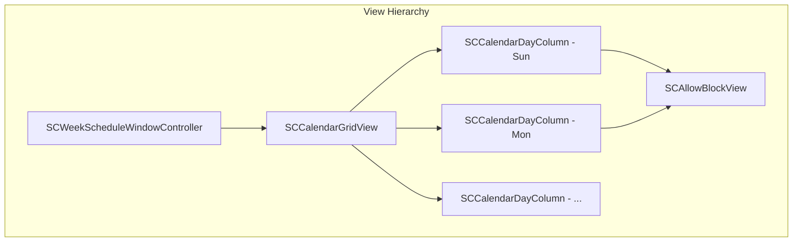
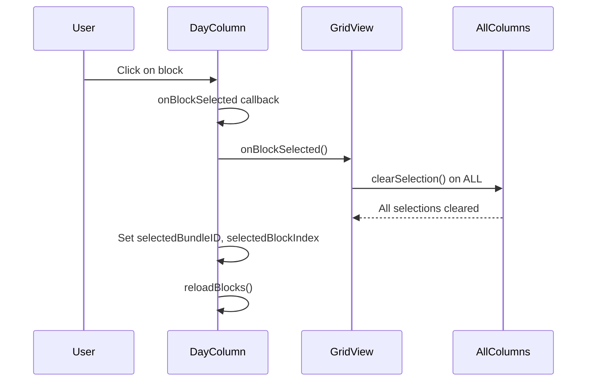
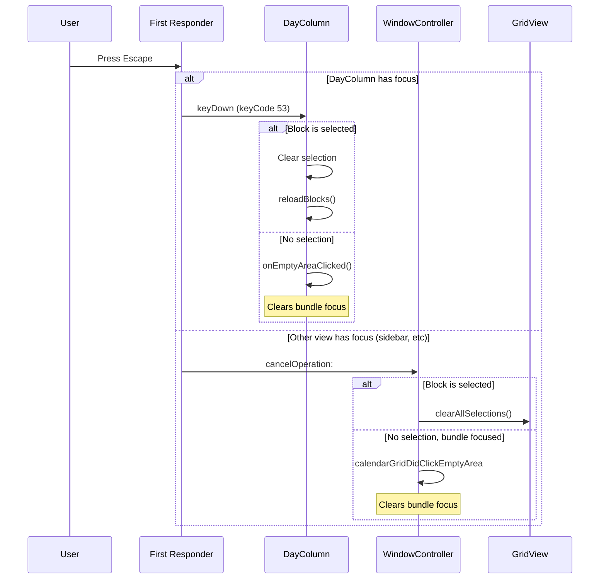
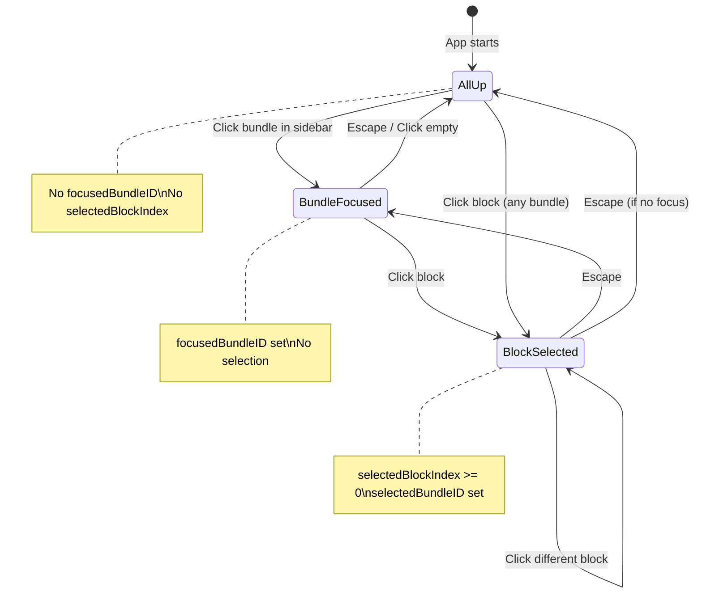

# Warm Start: Selection & Escape Logic

## Overview

This document covers block selection and Escape key handling in the calendar grid UI.

**Goal:** Single selection only, Escape progressively cancels (selection → focus → nothing).

---

## Architecture



---

## Key Files & Functions

### SCCalendarGridView.m

| Line | Symbol | Purpose |
|------|--------|---------|
| 140-142 | `selectedBlockIndex`, `selectedBundleID` | Per-column selection state |
| 150 | `onBlockSelected` callback | Notify parent when block selected |
| 153 | `clearSelection` method | Clear this column's selection |
| 306-310 | `clearSelection` impl | Resets index to -1, reloads |
| 340-344 | mouseDown block selection | Calls `onBlockSelected`, then sets selection |
| 531-544 | keyDown Escape handling | Clears selection first, then calls `onEmptyAreaClicked` |
| 810-815 | `onBlockSelected` wiring | Clears ALL columns when any block selected |
| 965-977 | `hasSelectedBlock`, `clearAllSelections` | Public API for window controller |

### SCCalendarGridView.h

| Line | Symbol | Purpose |
|------|--------|---------|
| 75-78 | `hasSelectedBlock`, `clearAllSelections` | Public methods for selection management |

### SCWeekScheduleWindowController.m

| Line | Symbol | Purpose |
|------|--------|---------|
| 1022-1029 | `cancelOperation:` | Escape handler - clears selection first, then focus |

---

## Selection Flow



---

## Escape Key Flow



---

## State Model



---

## Current Issues / TODO

1. **Selection state is per-column** - Each `SCCalendarDayColumn` has its own `selectedBlockIndex` and `selectedBundleID`. The `onBlockSelected` callback clears all, but state is distributed.

2. **Multiple Escape handlers** - Both `SCCalendarDayColumn.keyDown:` and `SCWeekScheduleWindowController.cancelOperation:` handle Escape. Which fires depends on first responder.

3. **Debug logging** - `SCCalendarGridView.keyDown:` has NSLog statements that should be removed.

---

## Quick Test Checklist

- [ ] Click block A → selected (highlighted)
- [ ] Click block B → A deselected, B selected
- [ ] Press Escape → B deselected, bundle still focused
- [ ] Press Escape again → bundle focus cleared, All-Up state
- [ ] Click bundle in sidebar → focused
- [ ] Press Escape (without clicking calendar) → focus cleared

---

## Code Snippets

### Single Selection (SCCalendarGridView.m:340-344)
```objc
// Single click on block - clear all other selections first, then select this one
if (self.onBlockSelected) {
    self.onBlockSelected();  // Parent will clear ALL selections
}
self.selectedBundleID = blockBundleID;
```

### Escape in Day Column (SCCalendarGridView.m:531-544)
```objc
- (void)keyDown:(NSEvent *)event {
    // Escape key - progressive: first clear selection, then clear focus
    if (event.keyCode == 53) {  // Escape
        if (self.selectedBlockIndex >= 0) {
            // First: clear block selection
            self.selectedBlockIndex = -1;
            self.selectedBundleID = nil;
            [self reloadBlocks];
        } else if (self.onEmptyAreaClicked) {
            // Second: clear bundle focus
            self.onEmptyAreaClicked();
        }
        return;
    }
    // ...
}
```

### Escape in Window Controller (SCWeekScheduleWindowController.m:1022-1029)
```objc
- (void)cancelOperation:(id)sender {
    // Escape key - progressive: first clear selection, then clear focus
    if ([self.calendarGridView hasSelectedBlock]) {
        [self.calendarGridView clearAllSelections];
    } else if (self.focusedBundleID) {
        [self calendarGridDidClickEmptyArea:self.calendarGridView];
    }
}
```

---

## Related Dictionary Terms

- **Bundle** - Named group of websites/apps to block
- **Allowed Window** - Time range when bundle is NOT blocked
- **Block** (UI) - Visual representation of an allowed window in calendar
- **Focus State** - A bundle is selected for editing (sidebar highlight + full opacity)
- **All-Up State** - No bundle focused, all shown at reduced opacity
