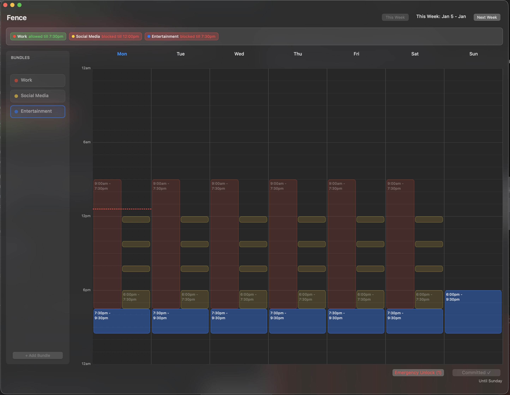

# Fence

<p align="center">
    
</p>

## About

**Fence** is an open-source macOS application that blocks distracting websites and apps on a weekly schedule. Set your blocking schedule for the entire week, commit to it once, and stick with it—no undos, no exceptions.

Unlike traditional website blockers that let you disable blocking on a whim, Fence enforces your commitment. Once you start a block:
- ✅ **Schedule for the week** - Define when sites/apps are blocked each day
- ✅ **Commit once** - Lock in your schedule after planning
- ✅ **No escape hatches** - Blocks persist even through reboots or app deletion
- ✅ **Block websites AND apps** - Prevent access to both web distractions and desktop apps (Terminal, Cursor, etc.)

## Download

To download the built app, visit [usefence.app](https://usefence.app).

## Credits

Originally forked from [SelfControl](https://selfcontrolapp.com/) by [Charlie Stigler](http://charliestigler.com) and [Steve Lambert](http://visitsteve.com).

Fence was created and is maintained by [Vishal Jain](https://github.com/vishalja1n).

## License

Fence is free software under the GPL. See [this file](./COPYING) for more details.

## Building and Running Fence

> **Want to fork/run without licensing?** See [SETUP.md](./SETUP.md#removing-licensing-logic-for-forks) for instructions on removing the licensing system.

### Prerequisites

- **macOS** (tested on macOS 12+)
- **Xcode** (latest version recommended)
- **Xcode Command Line Tools** - Install with: `xcode-select --install`
- **CocoaPods** - Dependency manager for the project

### Setup Instructions

1. **Clone the repository**
   ```bash
   git clone https://github.com/vishalja1n/fence.git
   cd fence
   ```

2. **Install CocoaPods** (if not already installed)
   ```bash
   sudo gem install cocoapods
   ```

3. **Install dependencies**
   ```bash
   pod install
   ```

4. **Open the workspace**
   ```bash
   open SelfControl.xcworkspace
   ```

   ⚠️ **Important:** Always open `SelfControl.xcworkspace`, **NOT** `SelfControl.xcodeproj`. Opening the project file will cause linker errors.

5. **Build and run**

   **Option A: Using Xcode**
   - Select the "SelfControl" scheme
   - Click the Run button (⌘R)
   - You may need to adjust code signing settings in the project settings

   **Option B: Using Command Line (Debug)**
   ```bash
   xcodebuild -workspace SelfControl.xcworkspace \
              -scheme SelfControl \
              -configuration Debug
   ```

   **Option C: Using Command Line (Release)**
   ```bash
   xcodebuild -workspace SelfControl.xcworkspace \
              -scheme SelfControl \
              -configuration Release \
              -derivedDataPath build/DerivedData \
              -arch arm64
   ```

6. **Run the application**
   ```bash
   open build/Release/SelfControl.app
   ```

   Note: The app requires proper code signing to install the privileged helper tool that performs blocking.

### Building a Release

To create a signed, notarized release with a DMG installer:

```bash
./scripts/build-release.sh 1.0
```

This will create a distributable DMG in the `build/` directory.

### Troubleshooting

**Problem: "library 'Pods-SCKillerHelper' not found"**
- **Solution:** You opened the `.xcodeproj` file instead of `.xcworkspace`. Close Xcode and open `SelfControl.xcworkspace`.

**Problem: Code signing errors**
- **Solution:** In Xcode, go to the project settings → Signing & Capabilities, and either:
  - Sign in with your Apple ID and select your team
  - Or disable "Automatically manage signing" and select a valid certificate

**Problem: Helper tool installation fails**
- **Solution:** This is usually a signing issue. The helper tool requires a valid Developer ID or Ad-Hoc signing to install via `SMJobBless`.

### Project Structure

- `SelfControl.app` - Main application (user interface)
- `selfcontrold` - Privileged daemon that performs blocking (runs as root)
- `SCKillerHelper` - Helper tool for terminating blocked apps
- `Common/` - Shared code between app and daemon
- `Block Management/` - Blocking engine (hosts file, packet filter, app blocker)

### Contributing

Contributions are welcome! Please feel free to submit pull requests or open issues for bugs and feature requests.

## Support This Project

If Fence helps you stay focused, consider [purchasing a license](https://usefence.app) or contributing any amount via [Buy Me a Coffee](https://buymeacoffee.com/vishalja1n) - either one helps keep development going.
