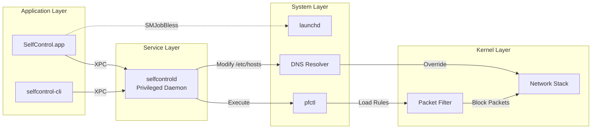
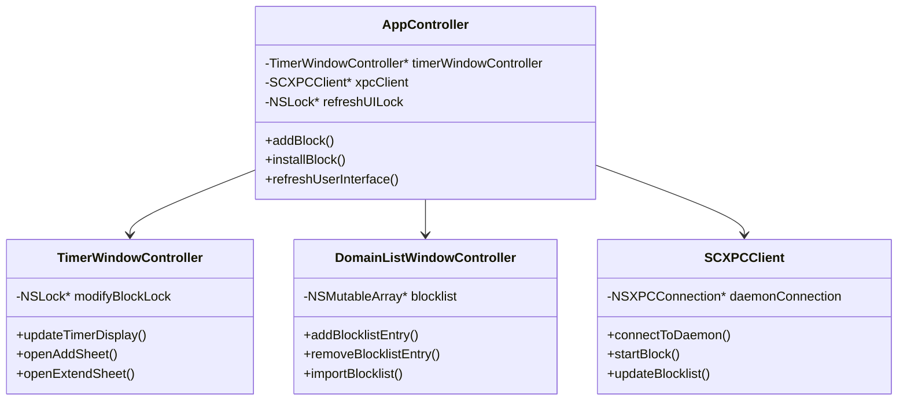
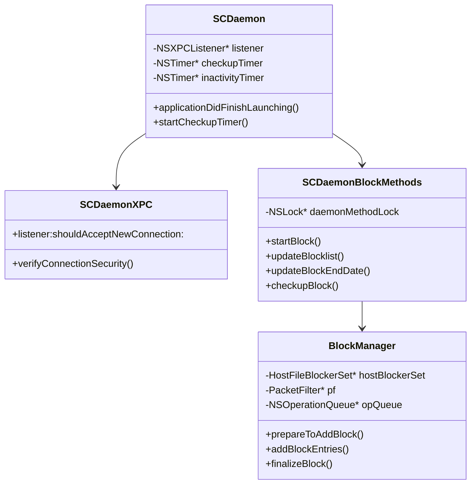
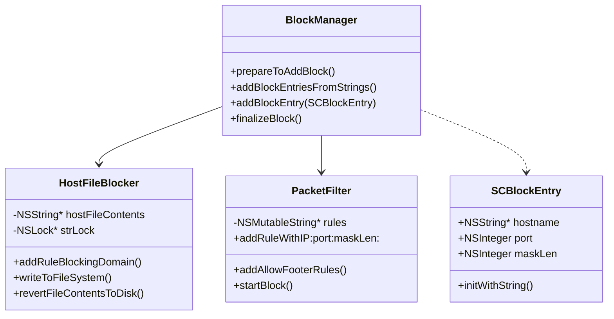
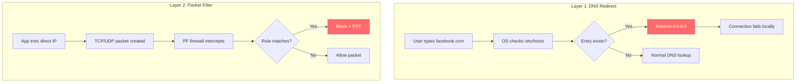
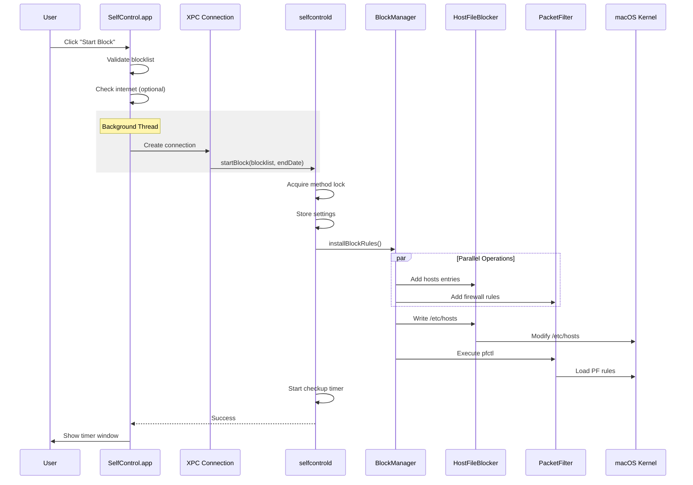
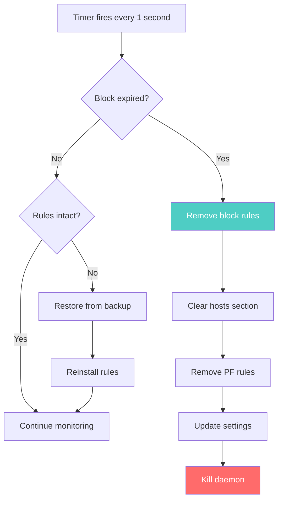
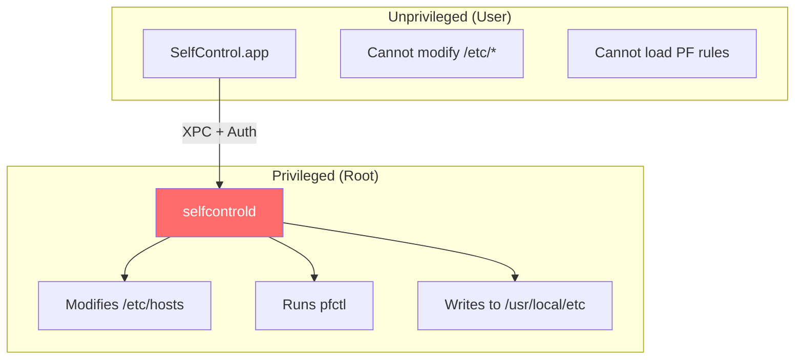
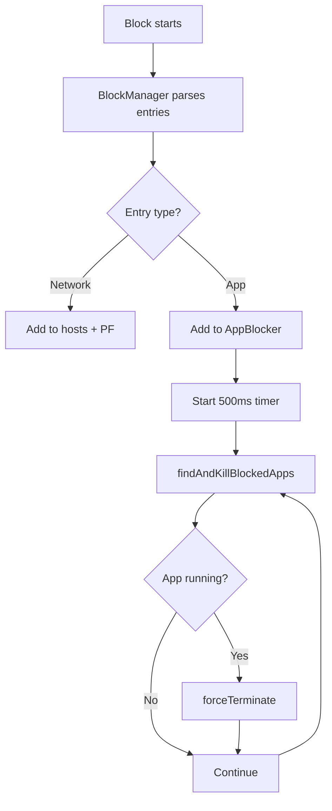

# SelfControl System Architecture

> **Version:** 4.0.2 (Build 410)
> **Purpose:** Comprehensive technical documentation for developers and AI agents
> **Last Updated:** December 2024

---

## Table of Contents

1. [Executive Summary](#1-executive-summary)
2. [High-Level Architecture](#2-high-level-architecture)
3. [Component Deep Dive](#3-component-deep-dive)
4. [Blocking Mechanism](#4-blocking-mechanism)
5. [App Blocking (NEW)](#5-app-blocking-new)
6. [Data Flow Diagrams](#6-data-flow-diagrams)
7. [Module Reference](#7-module-reference)
8. [Security Model](#8-security-model)
9. [Debug Mode](#9-debug-mode)
10. [Quick Reference](#10-quick-reference)

---

## 1. Executive Summary

SelfControl is a macOS application that blocks access to specified websites/network resources for a defined time period. **The block cannot be disabled** until the timer expires—even restarting the computer won't help.

### Key Architectural Decisions

| Decision | Rationale |
|----------|-----------|
| **Triple-layer blocking** | /etc/hosts + PF firewall + App killer provides redundancy |
| **Privileged daemon** | Root access needed for system files; separated from UI |
| **XPC communication** | Secure IPC between unprivileged app and root daemon |
| **Continuous verification** | 1-second checkup timer ensures block persists |
| **Settings in /usr/local/etc** | Survives app deletion; requires root to modify |
| **App blocking via process kill** | Polls running apps every 500ms, kills blocked ones |

### Technology Stack

- **Language:** Objective-C
- **Frameworks:** Cocoa, Security.framework, ServiceManagement
- **IPC:** XPC (Mach message-based)
- **Firewall:** macOS Packet Filter (PF/pf.conf)
- **DNS Override:** /etc/hosts modification

---

## 2. High-Level Architecture

### 2.1 System Overview

```mermaid
graph TB
    subgraph "User Space"
        APP[SelfControl.app<br/>Bundle: org.eyebeam.SelfControl]
        CLI[selfcontrol-cli<br/>Command Line Tool]
    end

    subgraph "Privileged Space (root)"
        DAEMON[selfcontrold<br/>LaunchDaemon]
    end

    subgraph "System Resources"
        HOSTS[/etc/hosts]
        PF[/etc/pf.conf<br/>+ /etc/pf.anchors/org.eyebeam]
        SETTINGS[/usr/local/etc/.{hash}.plist]
        LAUNCHD[launchd]
    end

    APP -->|XPC| DAEMON
    CLI -->|XPC| DAEMON
    DAEMON -->|Modify| HOSTS
    DAEMON -->|pfctl| PF
    DAEMON -->|Read/Write| SETTINGS
    LAUNCHD -->|Manages| DAEMON

    style DAEMON fill:#ff6b6b,color:#fff
    style HOSTS fill:#4ecdc4,color:#fff
    style PF fill:#4ecdc4,color:#fff
```

### 2.2 Process Relationships



---

## 3. Component Deep Dive

### 3.1 Main Application (SelfControl.app)

**Purpose:** User interface for configuring and starting blocks



**Key Files:**
| File | Lines | Purpose |
|------|-------|---------|
| `AppController.m` | ~806 | Main app controller, block installation |
| `TimerWindowController.m` | ~450 | Timer display, add/extend sheets |
| `DomainListWindowController.m` | ~300 | Blocklist editor table view |

### 3.2 Daemon (selfcontrold)

**Purpose:** Privileged helper that modifies system files



**Key Files:**
| File | Lines | Purpose |
|------|-------|---------|
| `Daemon/SCDaemon.m` | ~200 | Daemon lifecycle, timers |
| `Daemon/SCDaemonBlockMethods.m` | ~388 | Block control methods |
| `Daemon/SCDaemonXPC.m` | ~150 | XPC connection handling |

### 3.3 Block Management Layer



**Key Files:**
| File | Lines | Purpose |
|------|-------|---------|
| `Block Management/BlockManager.m` | ~531 | Orchestrates all blocking |
| `Block Management/HostFileBlocker.m` | ~250 | /etc/hosts manipulation |
| `Block Management/PacketFilter.m` | ~180 | PF rule generation |
| `Block Management/SCBlockEntry.m` | ~120 | Block entry data model |

---

## 4. Blocking Mechanism

### 4.1 Two-Layer Defense

SelfControl uses **two independent blocking mechanisms** for redundancy:



### 4.2 /etc/hosts Blocking

**How it works:**
1. Backup original: `/etc/hosts` → `/etc/hosts.bak`
2. Add SelfControl block section with markers
3. For each domain: add `0.0.0.0 domain` and `:: domain`
4. DNS lookups now return localhost (connection fails)

**Example /etc/hosts modification:**
```
# Normal system entries...
127.0.0.1 localhost

# BEGIN SELFCONTROL BLOCK
0.0.0.0    facebook.com
::    facebook.com
0.0.0.0    www.facebook.com
::    www.facebook.com
0.0.0.0    twitter.com
::    twitter.com
# END SELFCONTROL BLOCK
```

### 4.3 Packet Filter (PF) Blocking

**How it works:**
1. Resolve domains to IP addresses via DNS
2. Generate PF rules for each IP
3. Write to `/etc/pf.anchors/org.eyebeam`
4. Add anchor reference to `/etc/pf.conf`
5. Execute `pfctl -f /etc/pf.conf` to load rules

**Example PF rules (blocklist mode):**
```
# Blocklist rules
block return out proto tcp from any to 157.240.1.35
block return out proto udp from any to 157.240.1.35
block return out proto tcp from any to 104.244.42.1
block return out proto udp from any to 104.244.42.1

# Always allow essential services
pass out proto udp from any to any port 53    # DNS
pass out proto udp from any to any port 123   # NTP
pass out proto udp from any to any port 67    # DHCP
pass out proto udp from any to any port 68    # DHCP
pass out proto udp from any to any port 5353  # mDNS
pass out on lo0 all                           # Loopback
```

**Allowlist mode (inverse logic):**
```
# Block everything by default
block return out proto tcp from any to any
block return out proto udp from any to any

# Only allow specific destinations
pass out proto tcp from any to 1.2.3.4
pass out proto udp from any to 1.2.3.4

# Essential services still allowed
pass out proto udp from any to any port 53
# ... etc
```

### 4.4 Block Entry Format

```
Format: [hostname]:[port]/[masklen]

Examples:
  facebook.com           - Block all ports
  smtp.gmail.com:25      - Block only port 25
  192.168.1.0/24         - Block IP range
  *:443                  - Block port 443 everywhere
```

---

## 5. Data Flow Diagrams

### 5.1 Block Activation Flow



### 5.2 Checkup Timer Flow



### 5.3 Settings Synchronization

```mermaid
flowchart LR
    subgraph "App (User Space)"
        A[SCSettings<br/>Read-Only Mode]
    end

    subgraph "Daemon (Root)"
        B[SCSettings<br/>Read-Write Mode]
        C[Sync Timer<br/>30 sec batching]
    end

    subgraph "Filesystem"
        D[/usr/local/etc/.{hash}.plist]
    end

    A -->|Read| D
    B -->|Write| D
    C -->|Debounced| B

    style D fill:#4ecdc4,color:#fff
```

---

## 6. Module Reference

### 6.1 Directory Structure

```
SelfControl/
├── AppController.m/h              # Main app UI controller
├── TimerWindowController.m/h      # Active block timer window
├── DomainListWindowController.m/h # Blocklist editor
├── cli-main.m                     # CLI entry point
│
├── Block Management/              # CORE BLOCKING LOGIC
│   ├── BlockManager.m/h          # Orchestrator
│   ├── HostFileBlocker.m/h       # /etc/hosts
│   ├── HostFileBlockerSet.m/h    # Multiple hosts files
│   ├── PacketFilter.m/h          # PF rules
│   ├── SCBlockEntry.m/h          # Block entry model
│   ├── HostImporter.m/h          # Import from mail apps
│   └── AllowlistScraper.m/h      # Parse allowlists
│
├── Daemon/                        # PRIVILEGED DAEMON
│   ├── DaemonMain.m              # Entry point
│   ├── SCDaemon.m/h              # Lifecycle & XPC listener
│   ├── SCDaemonBlockMethods.m/h  # Block operations
│   ├── SCDaemonXPC.m/h           # XPC handler
│   └── SCDaemonProtocol.h        # XPC interface
│
├── Common/                        # SHARED CODE
│   ├── SCSettings.m/h            # Settings management
│   ├── SCXPCClient.m/h           # App-side XPC
│   ├── SCBlockFileReaderWriter.m/h # .selfcontrol files
│   ├── SCFileWatcher.m/h         # Tamper detection
│   └── Utility/
│       ├── SCBlockUtilities.m/h  # Block state checks
│       ├── SCHelperToolUtilities.m/h # Privileged ops
│       └── SCMiscUtilities.m/h   # General helpers
│
├── SCKillerHelper/                # Kill processes helper
└── SelfControl Killer/            # App killer GUI
```

### 6.2 Key Classes Quick Reference

| Class | Purpose | Touch for... |
|-------|---------|--------------|
| `AppController` | Main UI, block initiation | UI changes, block start flow |
| `BlockManager` | Orchestrates blocking | Adding new block types |
| `HostFileBlocker` | /etc/hosts manipulation | DNS-level blocking |
| `PacketFilter` | PF rule generation | Firewall rules |
| `SCBlockEntry` | Block entry data model | New entry formats |
| `SCDaemonBlockMethods` | Daemon block operations | Block lifecycle |
| `SCSettings` | Centralized settings | New preferences |
| `SCXPCClient` | App→Daemon communication | New XPC methods |

---

## 7. Security Model

### 7.1 Privilege Separation



### 7.2 XPC Security

1. **Code Signing Verification:** Daemon validates app's certificate
2. **Bundle ID Check:** Only `org.eyebeam.SelfControl` or CLI accepted
3. **Version Check:** Minimum version 4.0.7 required
4. **Team ID Validation:** Must match `L5YX8CH3F5`

### 7.3 Tampering Detection

```mermaid
flowchart LR
    A[SCFileWatcher] -->|Monitors| B[/etc/hosts]
    B -->|Changed| C{Block active?}
    C -->|Yes| D[checkBlockIntegrity]
    D -->|Tampered| E[Set TamperingDetected]
    E --> F[Change wallpaper]
    D -->|OK| G[Continue]

    style F fill:#ff6b6b,color:#fff
```

---

## 5. App Blocking (NEW)

### 5.1 Overview

App blocking adds a third layer of protection by monitoring and killing blocked applications.

```
┌─────────────────────────────────────────────────────────────────────────┐
│                    THREE-LAYER BLOCKING ARCHITECTURE                     │
├─────────────────────────────────────────────────────────────────────────┤
│                                                                          │
│   Layer 1: DNS Redirect (/etc/hosts) ............ [EXISTING]            │
│   Layer 2: Packet Filter (PF Rules) ............. [EXISTING]            │
│   Layer 3: App Blocker (Process Kill) ........... [NEW]                 │
│                                                                          │
└─────────────────────────────────────────────────────────────────────────┘
```

### 5.2 Entry Format

```
facebook.com           → Network block (Layer 1 + 2)
app:com.apple.Terminal → App block (Layer 3)
app:com.cursor.Cursor  → App block (Layer 3)
smtp.gmail.com:25      → Port-specific block (Layer 1 + 2)
```

### 5.3 Key Components

| File | Purpose |
|------|---------|
| `Block Management/AppBlocker.h/m` | Process monitor with 500ms timer |
| `Block Management/SCBlockEntry.h/m` | Extended with `appBundleID` property |
| `Block Management/BlockManager.h/m` | Routes app entries to AppBlocker |

### 5.4 How It Works



---

## 6. Debug Mode

### 6.1 Safety Feature for Development

Debug mode allows disabling ALL blocking during development. **Only available in DEBUG builds.**

```objc
#ifdef DEBUG
    [self setupDebugMenu];
#endif
```

### 6.2 Access

- **Menu:** Debug > Disable All Blocking
- **Indicator:** Window title shows "[DEBUG - BLOCKING DISABLED]"

### 6.3 What Gets Bypassed

| Blocker | When debug mode ON |
|---------|-------------------|
| PacketFilter.startBlock | Returns early, no PF rules |
| HostFileBlocker.writeNewFileContents | Returns early, no hosts changes |
| AppBlocker.findAndKillBlockedApps | Returns empty array, no kills |

### 6.4 Safety Guarantees

1. **Code compiled out of release builds** - `#ifdef DEBUG` wrapping
2. **Double protection** - Setting exists but never read in release
3. **Visual indicator** - Window title changes when active

---

## 7. Extension Points

### 7.1 Adding New Block Types

The current architecture is extensible via:

1. **SCBlockEntry** - Add new properties (like `appBundleID`)
2. **BlockManager** - Route entries to appropriate blockers
3. **New Blocker Class** - Implement blocking logic

### 7.2 Future Possibilities

| Extension | Approach |
|-----------|----------|
| System Extension (ES) | Prevent app launch entirely (no flicker) |
| Network Extension | Per-app network blocking |
| Screen Time integration | Use native macOS APIs |

---

## 8. Quick Reference

### 8.1 Important Paths

| Path | Purpose |
|------|---------|
| `/etc/hosts` | DNS redirect rules |
| `/etc/hosts.bak` | Backup before modification |
| `/etc/pf.conf` | Packet filter main config |
| `/etc/pf.anchors/org.eyebeam` | SelfControl's PF rules |
| `/usr/local/etc/.{SHA1}.plist` | Persistent settings |
| `/Library/LaunchDaemons/org.eyebeam.selfcontrold.plist` | Daemon config |
| `/Library/PrivilegedHelperTools/org.eyebeam.selfcontrold` | Daemon binary |

### 8.2 Key Settings

| Setting | Type | Purpose |
|---------|------|---------|
| `BlockIsRunning` | BOOL | Is block currently active? |
| `BlockEndDate` | NSDate | When does block expire? |
| `ActiveBlocklist` | Array | Currently blocked entries |
| `ActiveBlockAsWhitelist` | BOOL | Allowlist mode? |
| `TamperingDetected` | BOOL | Was tampering found? |
| `EvaluateCommonSubdomains` | BOOL | Auto-block www., mail., etc.? |
| `IncludeLinkedDomains` | BOOL | Block related domains? |
| `AllowLocalNetworks` | BOOL | Allow LAN access? |
| `ClearCaches` | BOOL | Clear browser caches? |
| `DebugBlockingDisabled` | BOOL | Debug override (DEBUG builds only) |

### 8.3 Error Codes

| Code | Meaning |
|------|---------|
| 100 | Blocklist empty (non-allowlist mode) |
| 104 | Block already running |
| 300 | Daemon method lock timeout |
| 301 | Cannot start - block running |
| 302 | Blocklist empty or block expired |

### 8.4 XPC Methods

```objc
// Start a new block
- (void)startBlockWithControllingUID:(uid_t)uid
                           blocklist:(NSArray<NSString*>*)blocklist
                         isAllowlist:(BOOL)isAllowlist
                             endDate:(NSDate*)endDate
                       blockSettings:(NSDictionary*)settings
                               reply:(void(^)(NSError*))reply;

// Add entries to active block
- (void)updateBlocklist:(NSArray<NSString*>*)newEntries
                  reply:(void(^)(NSError*))reply;

// Extend block duration
- (void)updateBlockEndDate:(NSDate*)newEndDate
                     reply:(void(^)(NSError*))reply;

// Get daemon version
- (void)getVersionWithReply:(void(^)(NSString*))reply;
```

---

## Appendix A: Build Targets

| Target | Type | Output |
|--------|------|--------|
| SelfControl | Application | SelfControl.app |
| selfcontrold | Helper Tool | org.eyebeam.selfcontrold |
| selfcontrol-cli | Command Line | selfcontrol-cli |
| SCKillerHelper | Helper Tool | SCKillerHelper |
| SelfControl Killer | Application | SelfControl Killer.app |

---

## Appendix B: Thread Safety

| Lock | Location | Purpose |
|------|----------|---------|
| `refreshUILock_` | AppController | Prevent UI race conditions |
| `modifyBlockLock` | TimerWindowController | Single add/extend sheet |
| `strLock` | HostFileBlocker | Thread-safe hosts manipulation |
| `daemonMethodLock` | SCDaemonBlockMethods | Exclusive block operations |

---

## Appendix C: Notification Names

| Notification | Purpose |
|--------------|---------|
| `org.eyebeam.SelfControl.SCSettingsValueChanged` | Settings changed (distributed) |
| `SCConfigurationChangedNotification` | Internal config change |

---

*This document is auto-generated and should be updated when significant architectural changes are made.*
