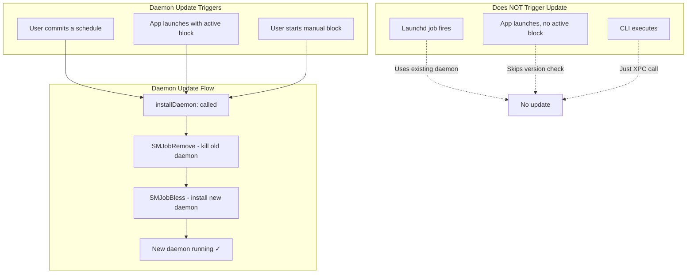
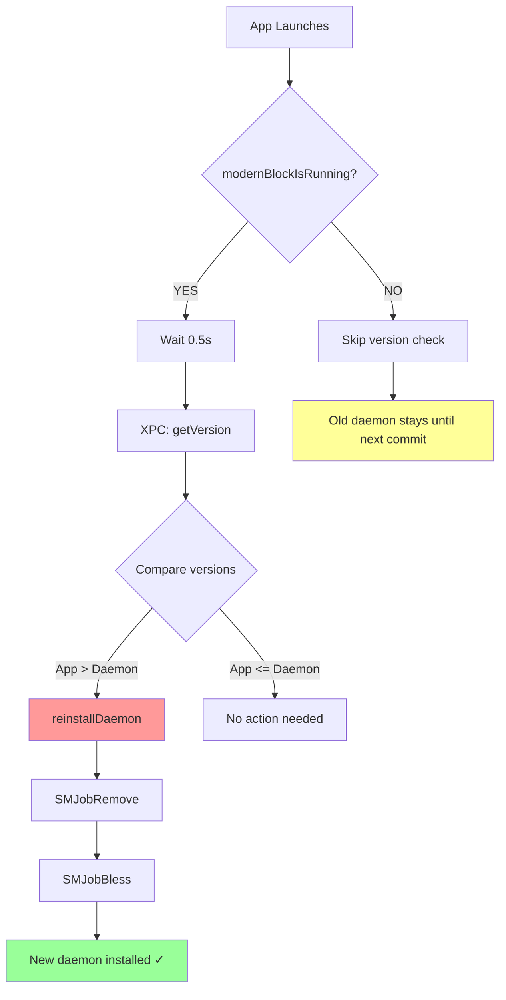
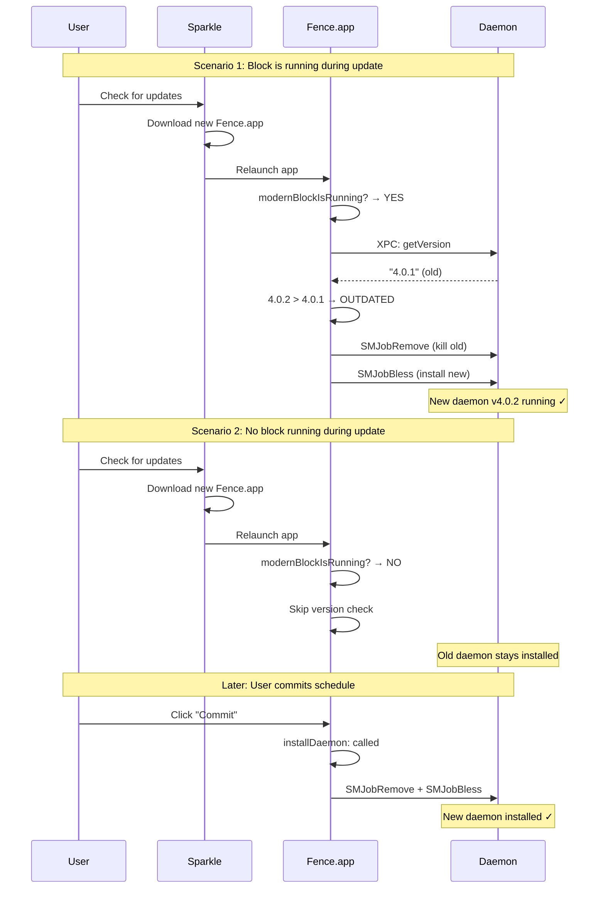
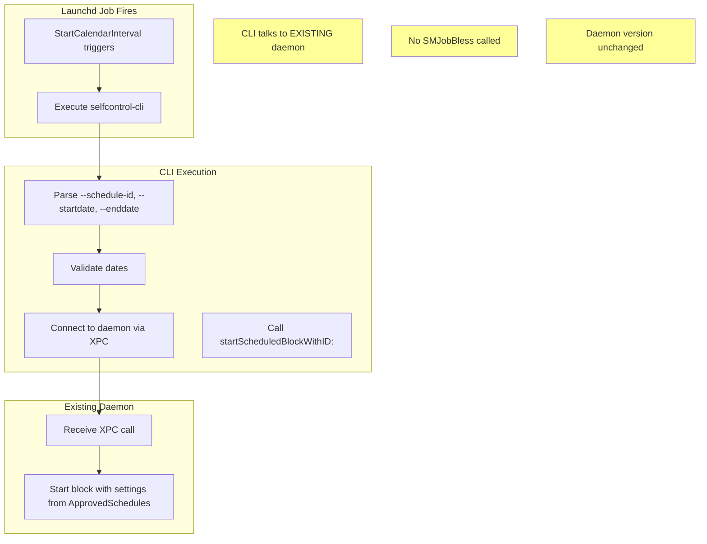

# Daemon Update Lifecycle

This document describes how the privileged daemon (`selfcontrold`) gets updated when the app is updated via Sparkle.

## Overview

The daemon is installed via `SMJobBless` to `/Library/PrivilegedHelperTools/org.eyebeam.selfcontrold`. It only gets updated when the main app explicitly reinstalls it - **not** when launchd jobs fire.

## Update Triggers



## App Launch Flow



## Sparkle Update Scenario



## Launchd Job Flow (No Daemon Update)



## Version Comparison

Both app and daemon use the same version from `version-header.h`:

```c
#define SELFCONTROL_VERSION_STRING @"4.0.2"
```

Comparison logic in `AppController.m`:

```objc
if ([SELFCONTROL_VERSION_STRING compare:daemonVersion options:NSNumericSearch] == NSOrderedDescending) {
    // App version > daemon version → reinstall
    [self reinstallDaemon];
}
```

## Key Files

| File | Purpose |
|------|---------|
| `Common/SCXPCClient.m` | `installDaemon:` method with SMJobBless |
| `AppController.m` | Version check on app launch |
| `version-header.h` | Single source of truth for version |
| `Daemon/SCDaemonXPC.m` | `getVersionWithReply:` implementation |

## Log Messages

When the app launches, look for these log messages:

```
# Block running → version check runs
AppController: Daemon update check - modernBlockIsRunning=YES, appVersion=4.0.2
AppController: Block is running, will check daemon version in 0.5s...
AppController: Daemon version check - daemonVersion=4.0.2, appVersion=4.0.2
AppController: Daemon UP-TO-DATE (4.0.2) - no action needed

# Block running, daemon outdated
AppController: Daemon OUTDATED (4.0.1 < 4.0.2) - reinstalling...

# No block running → skip check
AppController: Daemon update check - modernBlockIsRunning=NO, appVersion=4.0.2
AppController: No block running - skipping daemon version check (will update on next commit)
```

## Summary

| Event | Daemon Updated? | Why |
|-------|-----------------|-----|
| User commits schedule | ✅ Yes | `installDaemon:` called before registering jobs |
| App launches with active block | ✅ Yes | Version check + reinstall if outdated |
| User starts manual block | ✅ Yes | `installDaemon:` called |
| Launchd job fires | ❌ No | CLI just connects to existing daemon |
| App launches, no block | ❌ No | Version check skipped |

**Worst case:** User updates via Sparkle with no active block → old daemon until next commit (typically within a week).

---

*Last updated: January 2026*
