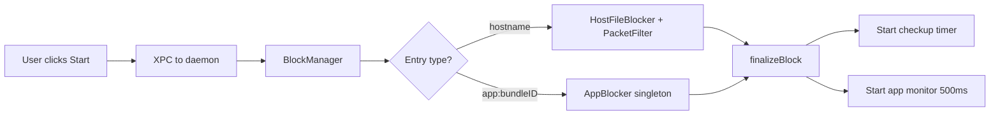

# SelfControl Documentation Index

> Quick navigation for developers and AI agents

---

## Quick Start: Where to Look

| I want to... | Read this | Key files |
|--------------|-----------|-----------|
| Understand the architecture | [SYSTEM_ARCHITECTURE.md](../SYSTEM_ARCHITECTURE.md) | - |
| Understand blocking | [BLOCKING_MECHANISM.md](BLOCKING_MECHANISM.md) | `BlockManager.m`, `PacketFilter.m`, `HostFileBlocker.m` |
| Understand app blocking | [BLOCKING_MECHANISM.md#app-blocking](BLOCKING_MECHANISM.md#app-blocking-implementation) | `AppBlocker.m`, `SCBlockEntry.m` |
| Modify the UI | - | `AppController.m`, `*.xib` files |
| Add XPC methods | - | `SCDaemonProtocol.h`, `SCDaemonXPC.m`, `SCXPCClient.m` |
| Debug block issues | [BLOCKING_MECHANISM.md](BLOCKING_MECHANISM.md) | `SCDaemonBlockMethods.m:checkupBlock` |

---

## Architecture Diagrams

### System Overview
```
┌─────────────────────────────────────────────────────────────┐
│                    USER SPACE                                │
│  ┌──────────────────┐    ┌───────────────────┐              │
│  │ SelfControl.app  │    │  selfcontrol-cli  │              │
│  │                  │    │                   │              │
│  │  AppController   │    │    cli-main.m     │              │
│  │  TimerWindow     │    │                   │              │
│  │  DomainList      │    │                   │              │
│  └────────┬─────────┘    └─────────┬─────────┘              │
│           │                        │                         │
│           └──────────┬─────────────┘                         │
│                      │ XPC                                   │
├──────────────────────┼──────────────────────────────────────┤
│                      ▼           PRIVILEGED SPACE            │
│           ┌──────────────────┐                               │
│           │   selfcontrold   │ ◄── Runs as root              │
│           │                  │                               │
│           │  SCDaemon        │                               │
│           │  SCDaemonXPC     │                               │
│           │  SCDaemonBlock   │                               │
│           │  Methods         │                               │
│           └────────┬─────────┘                               │
│                    │                                         │
│           ┌────────┴────────┐                                │
│           ▼                 ▼                                │
│    ┌────────────┐   ┌────────────┐                          │
│    │/etc/hosts  │   │  pfctl     │                          │
│    │Modification│   │  Firewall  │                          │
│    └────────────┘   └────────────┘                          │
└─────────────────────────────────────────────────────────────┘
```

### Block Activation Flow


---

## Module Map

```
SelfControl/
│
├── 📱 APP LAYER
│   ├── AppController.m ────────────── Main UI controller
│   ├── TimerWindowController.m ────── Timer during block
│   └── DomainListWindowController.m ─ Blocklist editor
│
├── 🔒 DAEMON LAYER (Daemon/)
│   ├── SCDaemon.m ─────────────────── Lifecycle & timers
│   ├── SCDaemonXPC.m ──────────────── XPC connection handler
│   └── SCDaemonBlockMethods.m ─────── Block operations
│
├── 🛡️ BLOCKING LAYER (Block Management/)
│   ├── BlockManager.m ─────────────── Orchestrator
│   ├── HostFileBlocker.m ──────────── /etc/hosts
│   ├── PacketFilter.m ─────────────── PF firewall
│   ├── AppBlocker.m ─────────────────  App process killer (singleton)
│   └── SCBlockEntry.m ─────────────── Entry data model (hosts + apps)
│
├── 🔧 COMMON LAYER (Common/)
│   ├── SCSettings.m ───────────────── Persistent settings
│   ├── SCXPCClient.m ──────────────── App's XPC client
│   └── Utility/
│       ├── SCBlockUtilities.m ─────── Block state checks
│       └── SCHelperToolUtilities.m ── Privileged helpers
│
└── 🖥️ CLI LAYER
    └── cli-main.m ─────────────────── Command line tool
```

---

## Key Concepts

### 1. Dual-Layer Blocking
- **Layer 1:** /etc/hosts redirects domains to 0.0.0.0
- **Layer 2:** PF firewall blocks IPs at packet level
- Both must be bypassed to circumvent block

### 2. Privilege Separation
- App runs as user (unprivileged)
- Daemon runs as root (privileged)
- Communication via XPC (secure IPC)

### 3. Persistence
- Settings stored in `/usr/local/etc/.{hash}.plist`
- Survives app deletion and reboot
- Only daemon (root) can modify

### 4. Continuous Verification
- Checkup timer runs every 1 second
- Verifies block rules still exist
- Restores if tampering detected

---

## Adding Features: Quick Guide

### Add a New Block Type

1. **Extend SCBlockEntry.m** - Add new property
2. **Modify BlockManager.m** - Handle new entry type
3. **Create Blocker class** - Implement blocking logic
4. **Integrate in SCDaemonBlockMethods.m** - Add to checkup
5. **Update UI** - Add controls to DomainListWindowController

### Add a New XPC Method

1. **Define in SCDaemonProtocol.h**
2. **Implement in SCDaemonXPC.m** (daemon side)
3. **Add client method in SCXPCClient.m** (app side)
4. **Call from AppController.m or TimerWindowController.m**

### Add a New Setting

1. **Define key in SCSettings.m**
2. **Add accessor methods**
3. **Add UI control in Preferences or main window**
4. **Handle in daemon if needed**

---

## Debugging Tips

### Block Not Working?
1. Check `/etc/hosts` for SelfControl section
2. Run `sudo pfctl -s rules -a org.eyebeam` to see PF rules
3. Check Console.app for daemon logs
4. Verify `BlockIsRunning` in settings plist

### Daemon Not Starting?
1. Check `/Library/LaunchDaemons/org.eyebeam.selfcontrold.plist` exists
2. Run `sudo launchctl list | grep selfcontrol`
3. Check system.log for SMJobBless errors

### XPC Connection Failing?
1. Verify code signing (app and daemon)
2. Check Info.plist SMPrivilegedExecutables
3. Ensure daemon binary in `/Library/PrivilegedHelperTools/`

---

## Glossary

| Term | Meaning |
|------|---------|
| **PF** | Packet Filter - macOS firewall |
| **pfctl** | Command-line tool to control PF |
| **XPC** | Cross-Process Communication (macOS IPC) |
| **SMJobBless** | Install privileged helper tool |
| **Anchor** | PF sub-ruleset (org.eyebeam) |
| **Blocklist** | List of blocked entries |
| **Allowlist** | Inverse - only listed entries allowed |
| **Checkup** | Periodic verification of block integrity |
