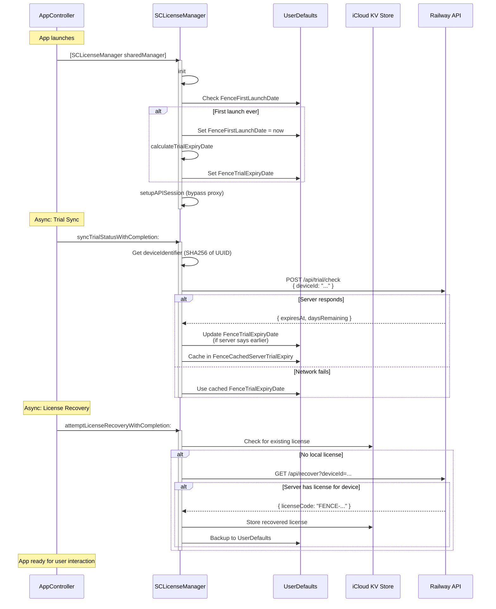
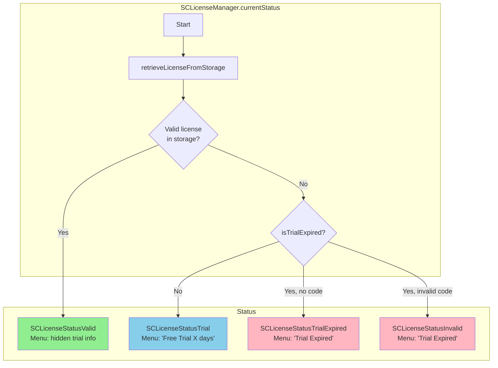
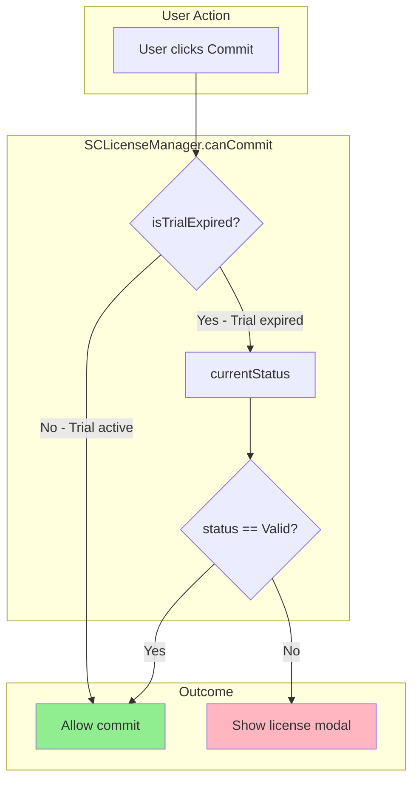
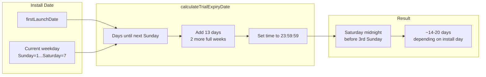
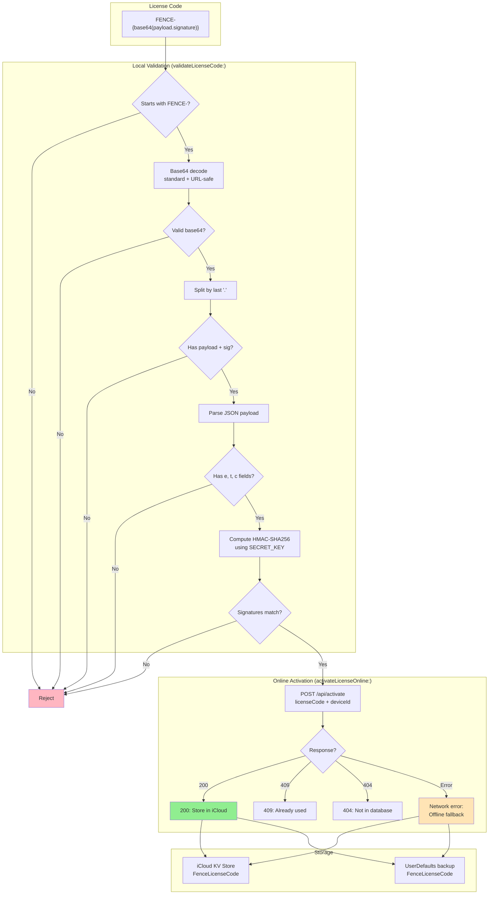
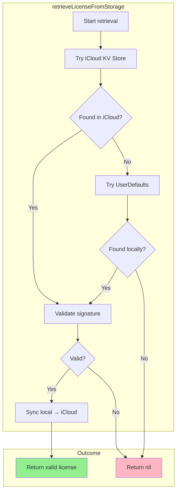

# Licensing System - Current Implementation

> **Source of Truth:** This document reflects the ACTUAL implementation as of January 2026.
>
> **Note:** `LICENSING_SPEC.md` and `LICENSING_HANDOVER.md` are outdated and should be considered historical references only.

---

## Documentation Status

| Document | Status | Issue |
|----------|--------|-------|
| `LICENSING_SPEC.md` | **Outdated** | Describes commit-based trial (2 commits); actual is date-based |
| `LICENSING_HANDOVER.md` | **Partially Outdated** | Says online activation "not yet implemented" but it IS implemented |
| `LICENSING_CURRENT.md` | **Current** | This document - reflects actual code |

---

## Overview

Fence uses a **date-based trial** with **server-synchronized state** and **iCloud license storage**.

| Component | Implementation |
|-----------|----------------|
| Trial | Expires Saturday midnight before 3rd Sunday from install (~2.5 weeks) |
| Storage | iCloud key-value store (primary) + UserDefaults (backup) |
| Server | Railway API at `fence-api-cli-production.up.railway.app` |
| Device ID | SHA256 hash of IOPlatformUUID |

---

## App Startup Flow



---

## License Status vs Commit Permission

There are **two different checks** with different logic:

| Method | Purpose | Logic |
|--------|---------|-------|
| `currentStatus` | Display status (menu, UI) | License checked FIRST, takes priority over trial |
| `canCommit` | Guard commit action | Short-circuits if trial active (doesn't distinguish licensed vs trial) |

### Status Display Flow (currentStatus)



**Key Point:** If you enter a license during trial, `currentStatus` immediately returns `SCLicenseStatusValid` and the menu shows you as licensed (hides trial info + "Enter License" option).

### Commit Permission Flow (canCommit)



**Note:** `canCommit` short-circuits if trial is active. This is fine because both trial users and licensed users can commit - the distinction only matters for display purposes.

---

## Trial Expiry Calculation



**Example:**
- Install on Monday → Trial = 19 days
- Install on Sunday → Trial = 20 days
- Install on Saturday → Trial = 14 days

---

## License Validation Flow



---

## License Retrieval Fallback Chain



---

## Key Code References

### Trial Logic

| File | Method | Lines | Purpose |
|------|--------|-------|---------|
| `Common/SCLicenseManager.m` | `ensureFirstLaunchDate` | 94-102 | Sets first launch date |
| `Common/SCLicenseManager.m` | `calculateTrialExpiryDate` | 106-128 | 3rd Sunday calculation |
| `Common/SCLicenseManager.m` | `trialExpiryDate` | 130-139 | Gets/caches expiry |
| `Common/SCLicenseManager.m` | `isTrialExpired` | 141-147 | Checks expiry |
| `Common/SCLicenseManager.m` | `trialDaysRemaining` | 149-158 | Days remaining |
| `Common/SCLicenseManager.m` | `canCommit` | 162-167 | Main commit guard |

### License Validation

| File | Method | Lines | Purpose |
|------|--------|-------|---------|
| `Common/SCLicenseManager.m` | `validateLicenseCode:error:` | 195-303 | Local HMAC validation |
| `Common/SCLicenseManager.m` | `activateLicenseOnline:completion:` | 460-549 | Server activation |
| `Common/SCLicenseManager.m` | `storeLicenseIniCloud:` | 374-390 | iCloud storage |
| `Common/SCLicenseManager.m` | `retrieveLicenseFromStorage` | 392-426 | iCloud + local retrieval |

### Server Sync

| File | Method | Lines | Purpose |
|------|--------|-------|---------|
| `Common/SCLicenseManager.m` | `syncTrialStatusWithCompletion:` | 553-616 | Trial sync with server |
| `Common/SCLicenseManager.m` | `attemptLicenseRecoveryWithCompletion:` | 620-703 | License recovery |
| `Common/SCDeviceIdentifier.m` | `+deviceIdentifier` | 14-34 | SHA256 of hardware UUID |

### Startup Hooks

| File | Location | Lines | Hook |
|------|----------|-------|------|
| `AppController.m` | awakeFromNib or init | 463-466 | `syncTrialStatusWithCompletion:` |
| `AppController.m` | awakeFromNib or init | 468-475 | `attemptLicenseRecoveryWithCompletion:` |
| `AppController.m` | commit action | 134-143 | `canCommit` guard |

### UI Integration

| File | Method | Lines | Purpose |
|------|--------|-------|---------|
| `SCLicenseWindowController.m` | `activateClicked:` | 206-242 | Activation button |
| `SCMenuBarController.m` | Trial status display | 185-208 | Menu bar status |
| `SCWeekScheduleWindowController.m` | Commit guard | 687-697 | Pre-commit license check |

---

## UserDefaults Keys

| Key | Type | Purpose |
|-----|------|---------|
| `FenceFirstLaunchDate` | NSDate | When app first launched |
| `FenceTrialExpiryDate` | NSDate | Calculated local expiry |
| `FenceCachedServerTrialExpiry` | NSDate | Server-synced expiry |
| `FenceLicenseCode` | NSString | License backup (also in iCloud) |

---

## Server Endpoints

**Base URL:** `https://fence-api-cli-production.up.railway.app`

| Endpoint | Method | Purpose |
|----------|--------|---------|
| `/api/trial/check` | POST | Sync trial status by device ID |
| `/api/activate` | POST | Activate license (marks as used) |
| `/api/recover` | GET | Recover license by device ID |

---

## Storage Architecture

```
┌─────────────────────────────────────────────────────────────────┐
│                         iCloud KV Store                         │
│                    (NSUbiquitousKeyValueStore)                  │
│                                                                 │
│  FenceLicenseCode = "FENCE-..."                                │
│  ─────────────────────────────────────────────────────────────  │
│  Syncs across all user's devices with same Apple ID             │
└─────────────────────────────────────────────────────────────────┘
                              │
                              │ Fallback
                              ▼
┌─────────────────────────────────────────────────────────────────┐
│                        UserDefaults                             │
│                                                                 │
│  FenceFirstLaunchDate = <NSDate>                               │
│  FenceTrialExpiryDate = <NSDate>                               │
│  FenceCachedServerTrialExpiry = <NSDate>                       │
│  FenceLicenseCode = "FENCE-..." (backup)                       │
│  ─────────────────────────────────────────────────────────────  │
│  Device-local, survives reinstalls                              │
└─────────────────────────────────────────────────────────────────┘
                              │
                              │ Server sync
                              ▼
┌─────────────────────────────────────────────────────────────────┐
│                      Railway API Server                         │
│                                                                 │
│  - Tracks which licenses are activated                          │
│  - Tracks trial expiry by device ID                             │
│  - Can recover licenses if local storage fails                  │
└─────────────────────────────────────────────────────────────────┘
```

**Note:** The implementation has moved AWAY from Keychain to iCloud key-value storage. Old documentation mentioning Keychain is outdated.

---

## Debug Commands

```bash
# Reset trial to fresh state
defaults delete org.eyebeam.Fence FenceTrialExpiryDate
defaults delete org.eyebeam.Fence FenceFirstLaunchDate

# Check trial expiry
defaults read org.eyebeam.Fence FenceTrialExpiryDate

# Check first launch date
defaults read org.eyebeam.Fence FenceFirstLaunchDate

# Delete local license backup
defaults delete org.eyebeam.Fence FenceLicenseCode

# Generate test license
node generate-test-license.js
```

---

*Last updated: January 2026*
