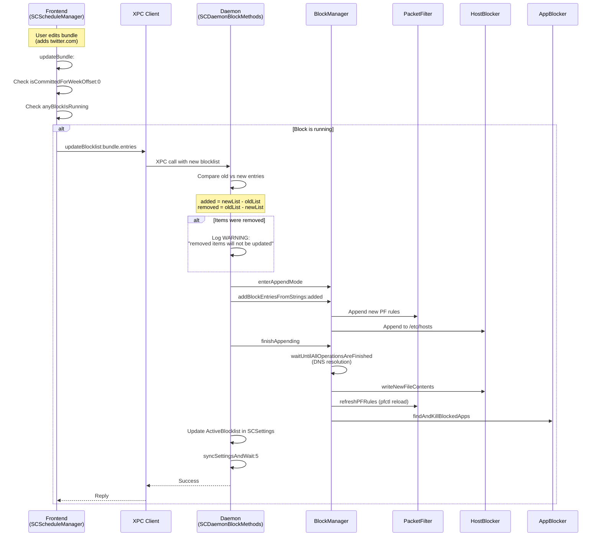

# Schedule Job Lifecycle

This document describes the complete lifecycle of scheduled blocking jobs, from user input to cleanup.

> **Note:** For timezone handling and travel scenarios, see [TIMEZONE_HANDLING.md](TIMEZONE_HANDLING.md).
>
> **Note:** For daemon timers, persistence, and sleep/wake behavior, see [DAEMON_LIFECYCLE.md](DAEMON_LIFECYCLE.md).

## Overview Diagram


## Job Firing Paths

There are **three paths** that can trigger a scheduled block:

| Path | Trigger | Use Case |
|------|---------|----------|
| **Path 1** | launchd fires at scheduled time | Normal operation |
| **Path 2** | Daemon startup | Reboot during scheduled window |
| **Path 3** | Periodic daemon sweep (1 min) | Sleep/wake, launchd failures, background permission disabled |


### Path 3: Why Periodic Sweep?

The 1-minute periodic sweep exists as a **backup mechanism** for cases where launchd (Path 1) fails:

| Scenario | launchd Behavior | Path 3 Saves the Day |
|----------|------------------|----------------------|
| **Sleep/wake** | May not fire jobs during sleep | Sweep catches it within 60s of wake |
| **Background permission disabled** | Jobs not loaded | Sweep bypasses launchd entirely |
| **launchd edge cases** | Rare timing issues | Sweep provides redundancy |

**Race condition safety:** The sweep always checks `anyBlockIsRunning` first. If launchd already started the block, the sweep exits early. Both paths can fire — only one will actually start the block.

## Block Lifecycle & Expiration


## Live Blocklist Updates (Strictify)

While a block is running, users can **add** items to bundles and have them take effect immediately. This is called "live strictify" — the block can only get **stricter**, never looser.

### Monotonic Security Constraint

| Action | Allowed? | Behavior |
|--------|----------|----------|
| **Add** item to bundle | ✅ Yes | Immediately blocked |
| **Remove** item from bundle | ❌ No | Silently ignored, logged as warning |

This prevents users from bypassing blocks by removing entries mid-session.

### Update Flow Diagram



### Timing

The update is **synchronous** — typically completes in **1-2 seconds**:

| Step | Time |
|------|------|
| XPC connection | ~100ms |
| DNS resolution for new domains | ~500ms-1s |
| Write /etc/hosts | ~10ms |
| Reload PF rules (pfctl) | ~100ms |
| Kill blocked apps | ~50ms |

### Launch Path Independence

The update mechanism works identically regardless of how the block was started:

| Launch Path | Storage Location | Update Works? |
|-------------|------------------|---------------|
| Path 1 (launchd) | `SCSettings.ActiveBlocklist` | ✅ Yes |
| Path 2 (daemon startup) | `SCSettings.ActiveBlocklist` | ✅ Yes |
| Path 3 (daemon sweep) | `SCSettings.ActiveBlocklist` | ✅ Yes |

All paths store the blocklist in the same `SCSettings` location (`/usr/local/etc/.hash.plist`), so `updateBlocklist:` reads from and writes to the same place regardless of how the block was initiated.

### Key Source Files

| File | Method | Purpose |
|------|--------|---------|
| `Block Management/SCScheduleManager.m` | `updateBundle:` | Frontend trigger, checks if committed + running |
| `Common/SCXPCClient.m` | `updateBlocklist:reply:` | XPC client wrapper |
| `Daemon/SCDaemonXPC.m` | `updateBlocklist:authorization:reply:` | XPC handler, auth check |
| `Daemon/SCDaemonBlockMethods.m` | `updateBlocklist:authorization:reply:` | Core logic: diff, append-only, sync |
| `Block Management/BlockManager.m` | `enterAppendMode`, `finishAppending` | Append to existing block |
| `Block Management/PacketFilter.m` | `enterAppendMode`, `finishAppending` | PF rule appending |

### Code Snippet: Monotonic Enforcement

From `SCDaemonBlockMethods.m:200-209`:

```objc
NSArray* activeBlocklist = [settings valueForKey: @"ActiveBlocklist"];
NSMutableArray* added = [NSMutableArray arrayWithArray: newBlocklist];
[added removeObjectsInArray: activeBlocklist];      // Items to ADD
NSMutableArray* removed = [NSMutableArray arrayWithArray: activeBlocklist];
[removed removeObjectsInArray: newBlocklist];       // Items user tried to REMOVE

// Removed items are IGNORED - monotonic security
if (removed.count > 0) {
    NSLog(@"WARNING: Active blocklist has removed items; these will not be updated. Removed items are %@", removed);
}

[blockManager enterAppendMode];
[blockManager addBlockEntriesFromStrings: added];   // Only ADD, never remove
[blockManager finishAppending];
```

## Cleanup Mechanisms

There are **two types of cleanup** for different scenarios:

| Cleanup Type | Purpose | What it clears |
|--------------|---------|----------------|
| `cleanupStaleScheduleWithID:` | Remove expired **job definition** | launchd plist + ApprovedSchedules entry |
| `clearExpiredBlockWithReply:` | Remove expired **blocking rules** | PF rules + /etc/hosts + AppBlocker + BlockIsRunning flag |

### Job Cleanup (cleanupStaleScheduleWithID)

Used when a scheduled job's `endDate` has passed - removes the job definition.


### Block Cleanup (clearExpiredBlockWithReply)

Used when an active block has expired but wasn't cleared (e.g., after sleep/wake when checkup timer couldn't run).


**Sleep/Wake Scenario:**
1. Block runs from 9:00-10:00
2. User closes laptop at 9:30 (sleep)
3. At 10:00, block should expire, but checkup timer is suspended
4. At 11:00, next scheduled block tries to start
5. CLI detects: `anyBlockIsRunning=YES` but `currentBlockIsExpired=YES`
6. CLI calls `clearExpiredBlock` to clear stale blocking rules
7. New block starts successfully

## Data Structures

### Launchd Plist (Job Definition)

```
~/Library/LaunchAgents/org.eyebeam.selfcontrol.schedule.merged-{UUID}.{day}.{time}.plist
```

```xml
<dict>
    <key>Label</key>
    <string>org.eyebeam.selfcontrol.schedule.merged-550e8400-e29b-41d4.tuesday.0930</string>

    <key>ProgramArguments</key>
    <array>
        <string>/Applications/SelfControl.app/Contents/MacOS/selfcontrol-cli</string>
        <string>start</string>
        <string>--schedule-id=550e8400-e29b-41d4</string>
        <string>--startdate=2026-01-06T09:30:00Z</string>
        <string>--enddate=2026-01-06T17:00:00Z</string>
    </array>

    <key>StartCalendarInterval</key>
    <dict>
        <key>Weekday</key><integer>2</integer>
        <key>Hour</key><integer>9</integer>
        <key>Minute</key><integer>30</integer>
    </dict>

    <key>RunAtLoad</key><false/>
</dict>
```

### ApprovedSchedules Entry

```
/usr/local/etc/.{hash}.plist → ApprovedSchedules dictionary
```

```objc
ApprovedSchedules[@"550e8400-e29b-41d4"] = @{
    @"blocklist": @[@"facebook.com", @"app:com.apple.Terminal"],
    @"isAllowlist": @NO,
    @"blockSettings": @{
        @"ClearCaches": @YES,
        @"AllowLocalNetworks": @NO
    },
    @"controllingUID": @501,
    @"registeredAt": <NSDate>
};
```

## Validation Logic


## Multi-Week Commit Scenario (Sunday)


## Key Files

| File | Purpose |
|------|---------|
| `Block Management/SCScheduleManager.m` | Commit flow, segment calculation, cleanup orchestration, **live strictify trigger** |
| `Block Management/SCScheduleLaunchdBridge.m` | Plist creation with startDate/endDate |
| `Block Management/BlockManager.m` | Block installation, **append mode for live updates** |
| `Block Management/PacketFilter.m` | PF rule management, **append mode for live updates** |
| `cli-main.m` | CLI arg parsing, validation, expired block detection, XPC calls |
| `Common/SCXPCClient.m` | XPC client wrapper, **updateBlocklist:** |
| `Daemon/SCDaemon.m` | Startup recovery, cleanup helper, **1-minute schedule sweep timer** |
| `Daemon/SCDaemonXPC.m` | XPC handlers for start block + cleanup + clearExpiredBlock + **updateBlocklist** |
| `Daemon/SCDaemonBlockMethods.m` | Actual block execution, checkup timer, **monotonic update enforcement** |

---

*Last updated: January 2026*
