# Timezone Handling in SelfControl

This document explains how SelfControl handles timezone changes, including travel scenarios and the design decisions behind the implementation.

## Overview

SelfControl uses a **timezone-rigid** design for anti-circumvention:
- Block times are stored as **absolute UTC timestamps**
- Users cannot escape blocks by changing their system timezone
- For travel, users should set their timezone to the destination **before** committing

---

## Core Concepts

### How Dates Are Stored

| Data | Storage Location | Format |
|------|------------------|--------|
| Block start/end times | launchd plist `ProgramArguments` | ISO8601 UTC (`2026-01-06T09:30:00Z`) |
| When launchd fires | launchd plist `StartCalendarInterval` | Local time (weekday, hour, minute) |
| Commitment end date | NSUserDefaults (`SCWeekCommitment_{weekKey}`) | NSDate (absolute timestamp) |
| Week key | Derived from local time | String (`"2024-12-23"`) |

### Drawn Allow Windows (Before Commit)

Allow windows drawn in the UI are stored as **timezone-agnostic minute offsets**:

```objc
// SCTimeRange stores just minutes from midnight
@property NSInteger startMinutes;  // e.g., 960 = 4pm (16 * 60)
@property NSInteger endMinutes;    // e.g., 1080 = 6pm (18 * 60)
```

**Key point:** 4pm is always 4pm in the UI - drawn blocks don't shift when you change timezone.

The timezone conversion only happens **at commit time**:
1. User draws 4pm-6pm allow window → stored as minutes (960-1080)
2. User changes Mac timezone to destination
3. User clicks "Commit"
4. App uses `[NSCalendar currentCalendar]` (now destination timezone) to calculate absolute dates
5. "4pm local" becomes the correct UTC time for the destination

This is why changing timezone before committing works - the drawn blocks stay visually the same, but the UTC conversion uses the new timezone.

### The Timezone Mismatch

There's an intentional mismatch between job firing and job validation:

```
launchd fires based on:     LOCAL clock time (StartCalendarInterval)
Validation uses:            UTC timestamps (--startdate, --enddate)
```

This prevents circumvention - changing timezone doesn't change when blocks end in absolute terms.

---

## Job Launch Paths

Jobs can start via two paths, both using UTC validation:

```mermaid
flowchart TD
    subgraph Path1["Path 1: launchd → CLI"]
        A1[launchd fires at local clock time] --> B1[CLI parses --startdate/--enddate]
        B1 --> C1{now vs UTC dates}
        C1 -->|now < startDate| D1[Skip - future week]
        C1 -->|now > endDate| E1[Cleanup - expired]
        C1 -->|in range| F1[Start block]
    end

    subgraph Path2["Path 2: Daemon Recovery"]
        A2[Daemon starts on boot] --> B2[Scan plist files]
        B2 --> C2[Parse --startdate/--enddate from args]
        C2 --> D2{now vs UTC dates}
        D2 -->|now < startDate| E2[Skip]
        D2 -->|now > endDate| F2[Cleanup]
        D2 -->|in range| G2[Start block]
    end
```



### Path 1: launchd → CLI

**File:** `cli-main.m` (lines 146-190)

```objc
// Parse UTC dates from command line args
NSISO8601DateFormatter* isoFormatter = [NSISO8601DateFormatter new];
NSDate* blockStartDateArg = [isoFormatter dateFromString: startDateString];
NSDate* blockEndDateArg = [isoFormatter dateFromString: endDateString];
NSDate* now = [NSDate date];

// Validate against absolute time
if (blockStartDateArg != nil && [now compare:blockStartDateArg] == NSOrderedAscending) {
    // Job is for future week - skip
    exit(EXIT_SUCCESS);
}

if (blockEndDateArg == nil || [now compare:blockEndDateArg] == NSOrderedDescending) {
    // Job has expired - cleanup
    // ...
}
```

### Path 2: Daemon Recovery

**File:** `Daemon/SCDaemon.m` (lines 273-304)

```objc
// Parse dates from plist ProgramArguments
NSISO8601DateFormatter *isoFormatter = [[NSISO8601DateFormatter alloc] init];
for (NSString *arg in args) {
    if ([arg hasPrefix:@"--startdate="]) {
        startDate = [isoFormatter dateFromString:[arg substringFromIndex:12]];
    } else if ([arg hasPrefix:@"--enddate="]) {
        endDate = [isoFormatter dateFromString:[arg substringFromIndex:10]];
    }
}

// Check using absolute time
BOOL expired = ([endDate timeIntervalSinceNow] <= 0);
BOOL tooEarly = (startDate != nil && [now compare:startDate] == NSOrderedAscending);
```

---

## Week Key Calculation

Week keys are calculated using **local time**, which means they shift with timezone changes.

**File:** `Block Management/SCWeeklySchedule.m` (lines 402-422)

```objc
+ (NSDate *)startOfWeekContaining:(NSDate *)date {
    NSCalendar *calendar = [NSCalendar currentCalendar];  // Uses LOCAL timezone
    NSDateComponents *components = [calendar components:NSCalendarUnitWeekday fromDate:date];
    NSInteger weekday = components.weekday;

    // Calculate days to subtract to get to Monday
    NSInteger daysToMonday = (weekday == 1) ? -6 : -(weekday - 2);
    NSDate *monday = [calendar dateByAddingUnit:NSCalendarUnitDay value:daysToMonday toDate:date options:0];

    return [calendar startOfDayForDate:monday];
}

+ (NSString *)weekKeyForDate:(NSDate *)date {
    NSDate *weekStart = [self startOfWeekContaining:date];
    NSDateFormatter *formatter = [[NSDateFormatter alloc] init];
    formatter.dateFormat = @"yyyy-MM-dd";
    return [formatter stringFromDate:weekStart];  // e.g., "2024-12-23"
}
```

### Week Key Shift Example

```
NYC (Monday 1am EST):  weekKey = "2024-12-23"  (This Monday)
LA  (Sunday 10pm PST): weekKey = "2024-12-16"  (Previous Monday!)
```

---

## Commitment Status

### How `isCommitted` is Computed

There is **no stored `isCommitted` variable**. It's computed on-the-fly:

**File:** `Block Management/SCScheduleManager.m` (lines 413-423)

```objc
- (BOOL)isCommittedForWeekOffset:(NSInteger)weekOffset {
    NSDate *endDate = [self commitmentEndDateForWeekOffset:weekOffset];
    if (!endDate) return NO;                      // No commitment stored
    return [endDate timeIntervalSinceNow] > 0;    // Is endDate still in future?
}

- (nullable NSDate *)commitmentEndDateForWeekOffset:(NSInteger)weekOffset {
    NSString *weekKey = [self weekKeyForOffset:weekOffset];
    NSString *storageKey = [kWeekCommitmentPrefix stringByAppendingString:weekKey];
    return [[NSUserDefaults standardUserDefaults] objectForKey:storageKey];
}
```


### Why This Design Works for Travel

When you travel, absolute time keeps moving forward even as local time shifts:

```
Old commitment endDate:  Dec 23, 5am UTC (Sunday midnight EST)
Current time in LA:      Dec 23, 6am UTC (Sunday 10pm PST)

[endDate timeIntervalSinceNow] = 5am - 6am = -1 hour (NEGATIVE)
Result: NO (unlocked)
```

The old commitment is **expired in absolute terms**, so it doesn't lock the week.

---

## Travel Scenarios

### Scenario 1: Eastward Travel (Forward in Time)

**Example:** LA (Sunday) → NYC (Monday)

```mermaid
flowchart TD
    subgraph Before["LA - Sunday 9pm PST"]
        A1["'This Week' = 2024-12-16"]
        A2["'Next Week' = 2024-12-23"]
        A3["User commits 'Next Week'"]
    end

    subgraph After["NYC - Monday 12am EST"]
        B1["'This Week' = 2024-12-23"]
        B2["Schedule appears in 'This Week'"]
        B3["✅ Everything works correctly"]
    end

    Before --> After
```



**Result:** Safe. "Next Week" naturally becomes "This Week" as time progresses.

### Scenario 2: Westward Travel (Back in Time)

**Example:** NYC (Monday 1am EST) → LA (Sunday 10pm PST)

```mermaid
flowchart TD
    subgraph Before["NYC - Monday 1am EST"]
        A1["'This Week' = 2024-12-23 🔒"]
        A2["Committed, jobs installed"]
    end

    subgraph After["LA - Sunday 10pm PST"]
        B1["'This Week' = 2024-12-16 🔓"]
        B2["'Next Week' = 2024-12-23 🔒"]
        B3["Original schedule in 'Next Week'"]
        B4["Can commit new schedule for 'This Week'"]
    end

    Before --> After
```



**What happens:**

| Aspect | Before (NYC) | After (LA) |
|--------|--------------|------------|
| Week key for offset 0 | "2024-12-23" | "2024-12-16" |
| "This Week" committed? | YES (locked) | NO (unlocked) |
| "Next Week" committed? | N/A | YES (locked) |
| Original schedule visible? | In "This Week" | In "Next Week" |
| Can commit "This Week"? | No | Yes |

---

## UI Update Mechanism

The UI `isCommitted` properties are refreshed from the manager on various triggers:

**File:** `SCWeekScheduleWindowController.m`

```objc
- (void)reloadData {
    SCScheduleManager *manager = [SCScheduleManager sharedManager];
    BOOL isCommitted = [manager isCommittedForWeekOffset:self.currentWeekOffset];

    // Update all UI views
    self.bundleSidebar.isCommitted = isCommitted;
    self.calendarGridView.isCommitted = isCommitted;
    self.weekGridView.isCommitted = isCommitted;
}
```

### When UI Refreshes

| Trigger | Code Location | Relevant for Travel? |
|---------|---------------|---------------------|
| System wake | `systemDidWake:` (line 315) | ✅ After flight |
| Refresh timer | `refreshTimerFired:` every 5 min (line 324) | ✅ Background |
| Window init | `initWithWindow:` (line 90) | If app reopened |
| Window resize | `windowDidResize:` (line 310) | Minor |

```mermaid
sequenceDiagram
    participant User
    participant System
    participant UI as SCWeekScheduleWindowController
    participant Manager as SCScheduleManager
    participant Defaults as NSUserDefaults

    User->>System: Opens laptop after flight
    System->>UI: systemDidWake notification
    UI->>UI: reloadData()
    UI->>Manager: isCommittedForWeekOffset:0
    Manager->>Manager: weekKeyForOffset:0 → "2024-12-16"
    Manager->>Defaults: lookup SCWeekCommitment_2024-12-16
    Defaults-->>Manager: endDate (or nil)
    Manager->>Manager: [endDate timeIntervalSinceNow] > 0?
    Manager-->>UI: NO (expired or missing)
    UI->>UI: self.calendarGridView.isCommitted = NO
    UI-->>User: Editing enabled ✅
```



---

## Cleanup Safety

### What Gets Cleaned vs Preserved

**File:** `Block Management/SCScheduleManager.m` (lines 851-925)

```objc
- (void)cleanupStaleScheduleJobs {
    NSDate *now = [NSDate date];

    for (NSString *file in files) {
        // Parse endDate from plist
        NSDate *endDate = [isoFormatter dateFromString:endDateStr];

        // Only cleanup if EXPIRED (endDate in past)
        if (endDate && [now compare:endDate] == NSOrderedDescending) {
            [staleSegmentIDs addObject:segmentID];
        }
    }
}
```

**Key:** Cleanup uses **UTC endDate comparison**, not week keys. Future jobs are always preserved.


### Recommit After Travel

When user commits for "This Week" after traveling:

1. **New endDate calculated** in current timezone
2. **Overwrites** old commitment value (same key, new date)
3. **New launchd jobs** created with new UTC dates
4. **Stale jobs** cleaned if their endDate has passed

```objc
// commitToWeekWithOffset: (lines 562-565)
NSString *weekKey = [self weekKeyForOffset:weekOffset];  // "2024-12-16"
NSString *storageKey = [kWeekCommitmentPrefix stringByAppendingString:weekKey];
[[NSUserDefaults standardUserDefaults] setObject:endOfWeek forKey:storageKey];
// endOfWeek = Sunday 23:59:59 in CURRENT timezone (LA)
```

---

## User Guidance

### For Traveling Users

> **Before traveling:** Change your Mac's timezone to your destination in System Preferences, **then** commit your schedule. Your blocks will operate correctly in the destination timezone.

### Why This Matters

| If you... | Then... |
|-----------|---------|
| Commit in origin timezone, then travel | Blocks fire at destination local time, but end at origin timezone's midnight |
| Change to destination timezone first, then commit | Everything aligned - blocks work correctly at destination |

### Premature Unlock / Zombie Lock

These are **expected behaviors**, not bugs:

| Scenario | What Happens | Why |
|----------|--------------|-----|
| **Premature Unlock** (westward) | Commitment ends earlier in local time | UTC endpoint reached earlier locally |
| **Zombie Lock** (eastward) | Commitment persists past local midnight | UTC endpoint not yet reached |

This is intentional - it prevents timezone circumvention while providing predictable behavior.

---

## Summary

| Component | Timezone Behavior |
|-----------|-------------------|
| `StartCalendarInterval` | Local time (when launchd fires) |
| `--startdate` / `--enddate` | UTC (validation) |
| Week key calculation | Local time (can shift) |
| Commitment endDate | Absolute NSDate (doesn't shift) |
| `isCommitted` check | Compares absolute times |
| Cleanup logic | Uses UTC endDate comparison |

**Design principle:** Blocks are anchored to **absolute time** for security. Users control their experience by setting timezone **before** committing.

---

*Last updated: January 2025*
