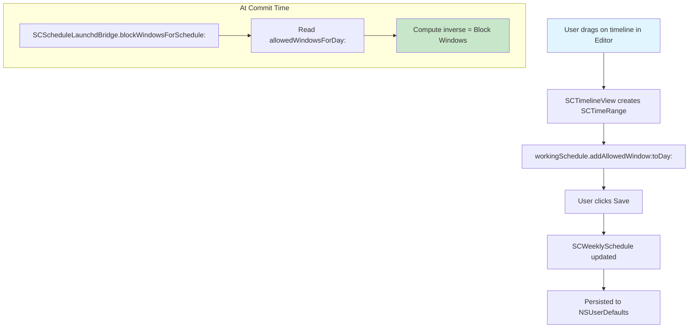

# Allowed Window

<!-- KEYWORDS: allowed, window, time range, permitted, access, SCTimeRange, schedule, day -->

**Also known as:** Time Range, Allowed Period, Access Window

---

## Brief Definition

A user-defined time range when a bundle's items are NOT blocked (access is permitted).

---

## Detailed Definition

An Allowed Window is represented by `SCTimeRange` and defines a start time and end time (in HH:MM format) during which the bundle's websites and apps can be accessed.

**Critical concept:** Users define when they ARE allowed access, and the system computes the inverse (Block Windows) for when blocking should be active.

| User Input | Meaning |
|------------|---------|
| Allowed Window 9:00-17:00 | Can access sites/apps from 9am to 5pm |
| No Allowed Windows (empty) | Blocked all day |
| Allowed Window 0:00-23:59 | Never blocked that day |

---

## Context/Trigger

- Created in the [Editor](editor.md) by dragging on the timeline
- Stored per bundle, per day in `SCWeeklySchedule.daySchedules`
- Read at commit time to compute [Block Windows](block-window.md)

---

## Code Locations

| File | Purpose |
|------|---------|
| `Block Management/SCTimeRange.h` | Data model for time range |
| `Block Management/SCTimeRange.m` | Implementation |
| `Block Management/SCWeeklySchedule.h` | `allowedWindowsForDay:` method |
| `Block Management/SCWeeklySchedule.m` | Storage in `daySchedules` dictionary |
| `SCDayScheduleEditorController.m` | UI for creating/editing windows |

---

## Data Model

```objc
@interface SCTimeRange : NSObject
@property (nonatomic, copy) NSString *startTime;  // "09:00"
@property (nonatomic, copy) NSString *endTime;    // "17:00"
@end
```

---

## Call Stack



---

## Related Terms

- [Editor](editor.md) - UI for creating Allowed Windows
- [Block Window](block-window.md) - Computed inverse of Allowed Windows
- [Bundle](bundle.md) - Each bundle has its own set of Allowed Windows per day

---

## Anti-definitions (What this is NOT)

- **NOT** when blocking is active - it's the OPPOSITE
- **NOT** the same as Block Window - Block Windows are computed from Allowed Windows
- **NOT** stored with absolute dates - only HH:MM times that repeat weekly

---

## Example

```
Bundle: "Social Media" (facebook.com, twitter.com)
Monday Allowed Windows: [12:00-13:00, 18:00-20:00]

Meaning: Can access social media during lunch (12-1pm) and evening (6-8pm)
         Blocked: 0:00-12:00, 13:00-18:00, 20:00-24:00
```
