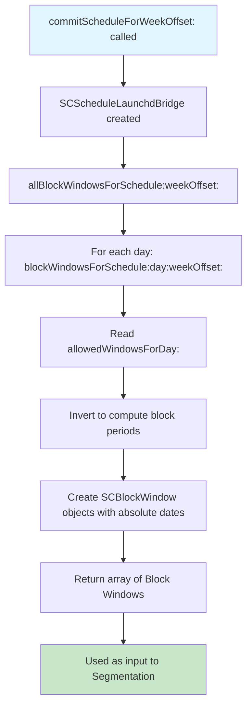

# Block Window

<!-- KEYWORDS: block, window, blocking, active, computed, inverse, SCBlockWindow, launchd -->

**Also known as:** Blocking Period, Block Time, Active Block

---

## Brief Definition

A computed time range when blocking IS active - the inverse of Allowed Windows.

---

## Detailed Definition

Block Windows are **not user-defined** - they are computed by inverting the user's Allowed Windows. Represented by `SCBlockWindow`, they contain absolute dates (not just times) and are used to create launchd jobs that trigger blocking at the right moments.

| Allowed Windows | Computed Block Windows |
|-----------------|------------------------|
| 9:00-17:00 | 0:00-9:00, 17:00-24:00 |
| 12:00-13:00, 18:00-20:00 | 0:00-12:00, 13:00-18:00, 20:00-24:00 |
| (none/empty) | 0:00-24:00 (blocked all day) |
| 0:00-24:00 | (none - no blocking) |

---

## Context/Trigger

- Computed at commit time by `SCScheduleLaunchdBridge`
- Used as input to [Segmentation](segment.md)
- Each Block Window becomes a potential launchd job trigger point

---

## Code Locations

| File | Purpose |
|------|---------|
| `Block Management/SCScheduleLaunchdBridge.h` | `SCBlockWindow` class definition |
| `Block Management/SCScheduleLaunchdBridge.m` | `blockWindowsForSchedule:day:weekOffset:` |

---

## Data Model

```objc
@interface SCBlockWindow : NSObject
@property (nonatomic, strong) NSDate *startDate;    // Absolute date/time
@property (nonatomic, strong) NSDate *endDate;      // Absolute date/time
@property (nonatomic, assign) SCDayOfWeek day;      // Which day of week
@property (nonatomic, assign) NSInteger startMinutes; // Minutes from midnight
@end
```

---

## Call Stack



---

## Related Terms

- [Allowed Window](allowed-window.md) - User input that Block Windows are computed from
- [Segment](segment.md) - Block Windows are input to segmentation
- [Committed State](committed-state.md) - Block Windows computed at commit time

---

## Anti-definitions (What this is NOT)

- **NOT** user-defined - computed from Allowed Windows
- **NOT** stored persistently - computed on-demand at commit time
- **NOT** the final unit of execution - that's Segments (which may combine multiple bundles)

---

## Algorithm

```
function computeBlockWindows(allowedWindows, day):
    if allowedWindows is empty:
        return [BlockWindow(0:00, 24:00)]  // Blocked all day

    sort allowedWindows by startTime
    blockWindows = []
    currentTime = 0:00

    for each allowed in allowedWindows:
        if currentTime < allowed.startTime:
            blockWindows.append(BlockWindow(currentTime, allowed.startTime))
        currentTime = allowed.endTime

    if currentTime < 24:00:
        blockWindows.append(BlockWindow(currentTime, 24:00))

    return blockWindows
```
