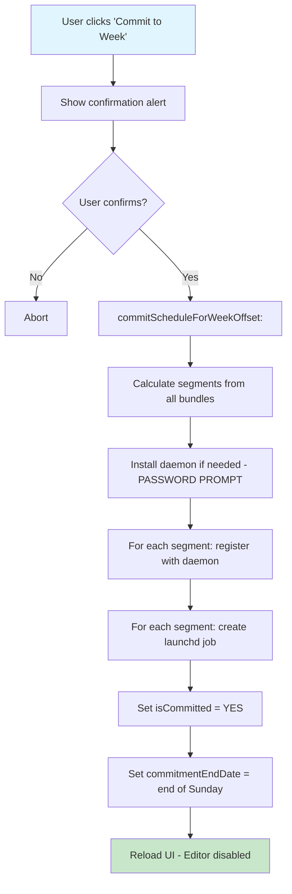

# Committed State

<!-- KEYWORDS: committed, commit, locked, finalized, readonly, schedule, week, isCommitted -->

**Also known as:** Locked State, Finalized Schedule

---

## Brief Definition

The state when a user has clicked "Commit to Week" and the schedule is locked - cannot be modified until the week ends.

---

## Detailed Definition

Committed State is entered when a user explicitly confirms their schedule for a given week. Once committed:

1. **Schedule is read-only** - Cannot add, remove, or resize Allowed Windows
2. **Editor is disabled** - Clicking day cells shows an alert instead of opening Editor
3. **Segments are pre-authorized** - Registered with daemon for password-free execution
4. **Anti-cheat protection** - Cannot make schedule "looser" (add more allowed time)

The commitment lasts until `commitmentEndDate` (typically end of Sunday).

---

## Context/Trigger

- User clicks "Commit to Week" button in `SCWeekScheduleWindowController`
- Confirmation alert shown with commitment terms
- Password prompt for daemon installation (once per session)
- All segments registered with daemon

---

## Code Locations

| File | Purpose |
|------|---------|
| `Block Management/SCScheduleManager.h` | `isCommitted` property |
| `Block Management/SCScheduleManager.m` | `commitScheduleForWeekOffset:` |
| `SCWeekScheduleWindowController.m` | Commit button action, UI restrictions |

---

## Data Model

```objc
// Per-week storage keys
static NSString * const kWeekCommitmentPrefix = @"SCWeekCommitment_";

// Commitment metadata
@{
    @"isCommitted": @YES,
    @"commitmentEndDate": <NSDate>,
    @"commitmentStartDate": <NSDate>
}
```

---

## Call Stack



---

## Related Terms

- [Editor](editor.md) - Cannot open when committed
- [Segment](segment.md) - Created at commit time
- [Pre-Authorized Schedule](pre-authorized-schedule.md) - Registered at commit time
- [Week Offset](week-offset.md) - Commitment is per-week

---

## Anti-definitions (What this is NOT)

- **NOT** the same as "saving" - saves are editable, commits are not
- **NOT** auto-triggered - requires explicit user action
- **NOT** reversible within the same week (anti-cheat measure)
- **NOT** a single timestamp - includes start date, end date, and status

---

## UI Behavior When Committed

| Action | Committed Behavior |
|--------|-------------------|
| Click day cell | Alert: "Schedule Locked" |
| Navigate weeks | Can view other weeks normally |
| View current week | Read-only, no editing |
| Start block manually | Still possible (separate from schedule) |

---

## Confirmation Dialog

```objc
NSAlert *alert = [[NSAlert alloc] init];
alert.messageText = [NSString stringWithFormat:@"Commit to %@?", weekName];
alert.informativeText = [NSString stringWithFormat:
    @"Once committed, the schedule is locked and cannot be modified. "
    @"This commitment lasts until %@.\n\n"
    @"Blocking will start immediately for any in-progress block windows.", lastDay];
[alert addButtonWithTitle:@"Commit"];
[alert addButtonWithTitle:@"Cancel"];
```
