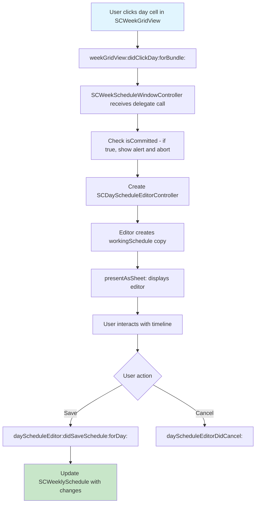

# Editor

<!-- KEYWORDS: editor, day editor, schedule editor, day schedule, timeline, click, cell, sheet, modal -->

**Also known as:** Day Editor, Day Schedule Editor, Timeline Editor

---

## Brief Definition

The UI sheet that opens when a user clicks on a bundle row's day column to define allowed windows.

---

## Detailed Definition

The Editor is a modal sheet (`SCDayScheduleEditorController`) that presents a 24-hour timeline view for a specific bundle and day. Users interact with the timeline to create, resize, and delete **Allowed Windows** - time ranges when the bundle's items are NOT blocked.

The Editor operates on a **working copy** of the schedule, allowing users to cancel without side effects.

---

## Context/Trigger

- User clicks a day cell in the week grid (`SCWeekGridView`)
- Opens as a sheet attached to the week schedule window
- Cannot open when schedule is in **Committed State**

---

## Code Locations

| File | Purpose |
|------|---------|
| `SCDayScheduleEditorController.h` | Header with delegate protocol |
| `SCDayScheduleEditorController.m` | Implementation (~1,321 lines) |
| `SCWeekGridView.m` | Triggers editor on cell click |
| `SCWeekScheduleWindowController.m` | Hosts the editor sheet |

---

## Call Stack

---

## Related Terms

- [Allowed Window](allowed-window.md) - What users create in the Editor
- [Committed State](committed-state.md) - When true, Editor cannot open
- [Bundle](bundle.md) - The Editor edits one bundle's schedule for one day

---

## Anti-definitions (What this is NOT)

- **NOT** the Bundle Editor (`SCBundleEditorController`) - that edits bundle properties (name, color, entries)
- **NOT** the week grid view - that's the overview showing all bundles × days
- **NOT** for editing entries - only for editing time schedules

---

## Visual Reference

The Editor displays:
- 24-hour vertical timeline
- Draggable/resizable blocks representing Allowed Windows
- Add/remove buttons
- Save/Cancel actions
