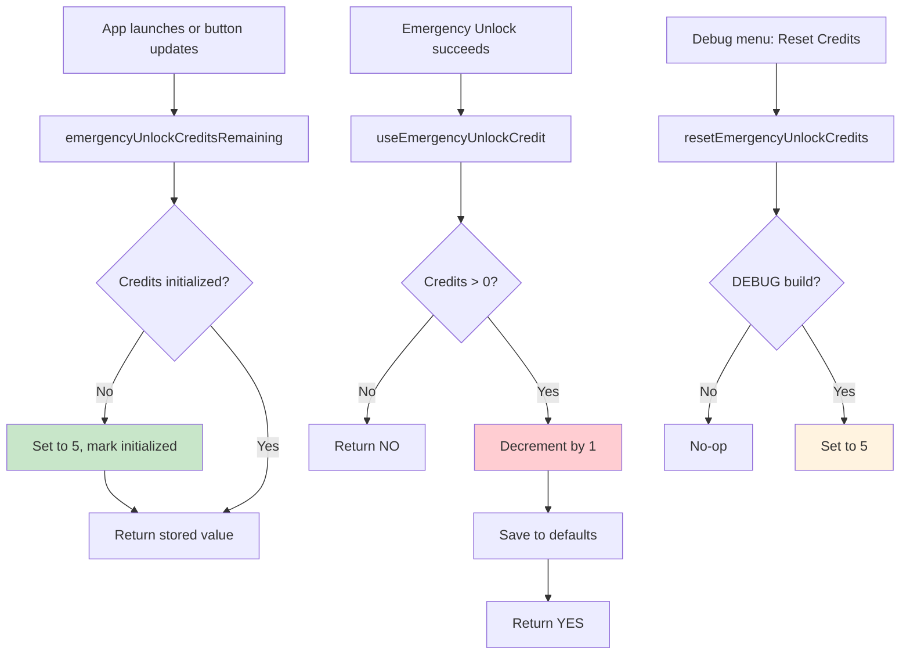

# Emergency Credits

<!-- KEYWORDS: credits, emergency, unlock, lifetime, finite, limited, currency, allowance -->

**Also known as:** Unlock Credits, Emergency Allowance

---

## Brief Definition

A finite currency (5 lifetime) that users spend to perform Emergency Unlocks. Credits do not replenish - once depleted, Emergency Unlock is no longer available.

---

## Detailed Definition

Emergency Credits are a limited resource designed to discourage casual use of Emergency Unlock. Each new user starts with 5 credits. When a credit is used:

1. It is permanently consumed (no regeneration)
2. The remaining count is displayed on the button
3. At 0 credits, Emergency Unlock becomes unavailable

**Design rationale:** The finite nature ensures users treat Emergency Unlock as a last resort rather than a regular escape mechanism. Five credits provides enough flexibility for genuine emergencies while maintaining the integrity of the commitment system.

---

## Context/Trigger

- Initialized to 5 on first access (lazy initialization)
- Decremented by 1 each time Emergency Unlock succeeds
- Displayed in button title: "Emergency Unlock (N)"
- Can be reset via Debug menu (DEBUG builds only)

---

## Code Locations

| File | Purpose |
|------|---------|
| `Block Management/SCScheduleManager.h` | Method declarations |
| `Block Management/SCScheduleManager.m` | `emergencyUnlockCreditsRemaining` |
| `Block Management/SCScheduleManager.m` | `useEmergencyUnlockCredit` |
| `Block Management/SCScheduleManager.m` | `resetEmergencyUnlockCredits` (DEBUG) |
| `AppController.m` | Debug menu: "Reset Emergency Credits" |

---

## Data Model

```objc
// Storage keys
static NSString * const kEmergencyUnlockCreditsKey = @"SCEmergencyUnlockCredits";
static NSString * const kEmergencyUnlockCreditsInitializedKey = @"SCEmergencyUnlockCreditsInitialized";
static const NSInteger kDefaultEmergencyUnlockCredits = 5;

// Stored in NSUserDefaults (user-level, not root-protected)
// Persists across app restarts and system reboots
```

---

## Call Stack



---

## Related Terms

- [Emergency Unlock](emergency-unlock.md) - The action that consumes credits
- [Committed State](committed-state.md) - Credits only matter when committed

---

## Anti-definitions (What this is NOT)

- ❌ NOT renewable - once used, credits are gone forever
- ❌ NOT purchasable - no way to acquire more credits
- ❌ NOT transferable - tied to the user's defaults
- ❌ NOT time-based - no daily/weekly reset

---

## State Transitions

| Credits | Button State | User Can Unlock? |
|---------|--------------|------------------|
| 5 | "Emergency Unlock (5)" enabled | Yes |
| 3 | "Emergency Unlock (3)" enabled | Yes |
| 1 | "Emergency Unlock (1)" enabled | Yes (last chance) |
| 0 | "Emergency Unlock (0)" disabled | No |

---

## Debug Reset (DEBUG builds only)

```objc
// Menu: Debug > Reset Emergency Credits
- (IBAction)resetEmergencyCredits:(id)sender {
    SCScheduleManager *manager = [SCScheduleManager sharedManager];
    [manager resetEmergencyUnlockCredits];  // Sets back to 5
}
```
