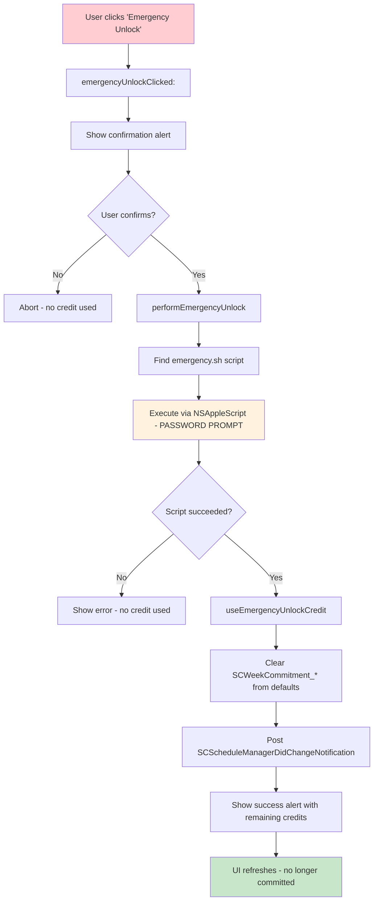

# Emergency Unlock

<!-- KEYWORDS: emergency, unlock, escape, override, break, committed, credits, password, emergency.sh -->

**Also known as:** Emergency Override, Escape Hatch

---

## Brief Definition

An action that immediately breaks out of Committed State, ending all active blocking. Requires spending one Emergency Credit and entering the system password.

---

## Detailed Definition

Emergency Unlock is a safety mechanism that allows users to escape their self-imposed restrictions when genuinely needed. It executes the `emergency.sh` script with administrator privileges to clear all blocking rules, daemon state, and commitment metadata.

**Key characteristics:**
- Only available when in Committed State
- Consumes one Emergency Credit (finite resource)
- Requires macOS administrator password
- Clears ALL blocking immediately (hosts, PF rules, daemon state)
- UI refreshes without app restart

---

## Context/Trigger

- User clicks "Emergency Unlock (N)" button in week schedule window
- Button only enabled when: `isCommitted == YES && creditsRemaining > 0`
- Confirmation dialog warns about credit consumption
- macOS password prompt via NSAppleScript

---

## Code Locations

| File | Purpose |
|------|---------|
| `SCWeekScheduleWindowController.m` | `emergencyUnlockButton` property |
| `SCWeekScheduleWindowController.m` | `emergencyUnlockClicked:` - confirmation flow |
| `SCWeekScheduleWindowController.m` | `performEmergencyUnlock` - script execution |
| `emergency.sh` | Shell script with cleanup commands |

---

## Data Model

```objc
// Button state determined by:
BOOL isCommitted = [manager isCommittedForWeekOffset:self.currentWeekOffset];
NSInteger credits = [manager emergencyUnlockCreditsRemaining];
self.emergencyUnlockButton.enabled = (isCommitted && credits > 0);

// Script execution via AppleScript
NSString *appleScriptSource = [NSString stringWithFormat:
    @"do shell script \"/bin/bash '%@'\" with administrator privileges", scriptPath];
```

---

## Call Stack



---

## emergency.sh Script Actions

```bash
1. launchctl bootout system/org.eyebeam.selfcontrold  # Stop daemon
2. pfctl -a org.eyebeam -F all                        # Clear firewall rules
3. sed -i '' '/SELFCONTROL BLOCK/d' /etc/hosts        # Clear hosts entries
4. dscacheutil -flushcache                            # Flush DNS
5. rm /usr/local/etc/.*.plist                         # Clear settings
6. defaults delete org.eyebeam.SelfControl SCIsCommitted  # Clear user defaults
```

---

## Related Terms

- [Committed State](committed-state.md) - The state this action escapes from
- [Emergency Credits](emergency-credits.md) - Currency consumed by this action

---

## Anti-definitions (What this is NOT)

- ❌ NOT a free escape - costs a finite credit
- ❌ NOT reversible - once used, the credit is gone
- ❌ NOT for regular use - designed for genuine emergencies only
- ❌ NOT available in uncommitted state - button is disabled

---

## UI Behavior

| State | Button Appearance |
|-------|-------------------|
| Not committed | Disabled, shows "(N)" credits |
| Committed, has credits | Enabled, red tint, shows "(N)" |
| Committed, 0 credits | Disabled, shows "(0)" |

---

## Confirmation Dialog

```objc
alert.messageText = @"Use Emergency Unlock?";
alert.informativeText = [NSString stringWithFormat:
    @"This will immediately end all blocking and use 1 of your %ld remaining emergency unlock%@.\n\n"
    @"This cannot be undone.",
    (long)credits, credits == 1 ? @"" : @"s"];
```
