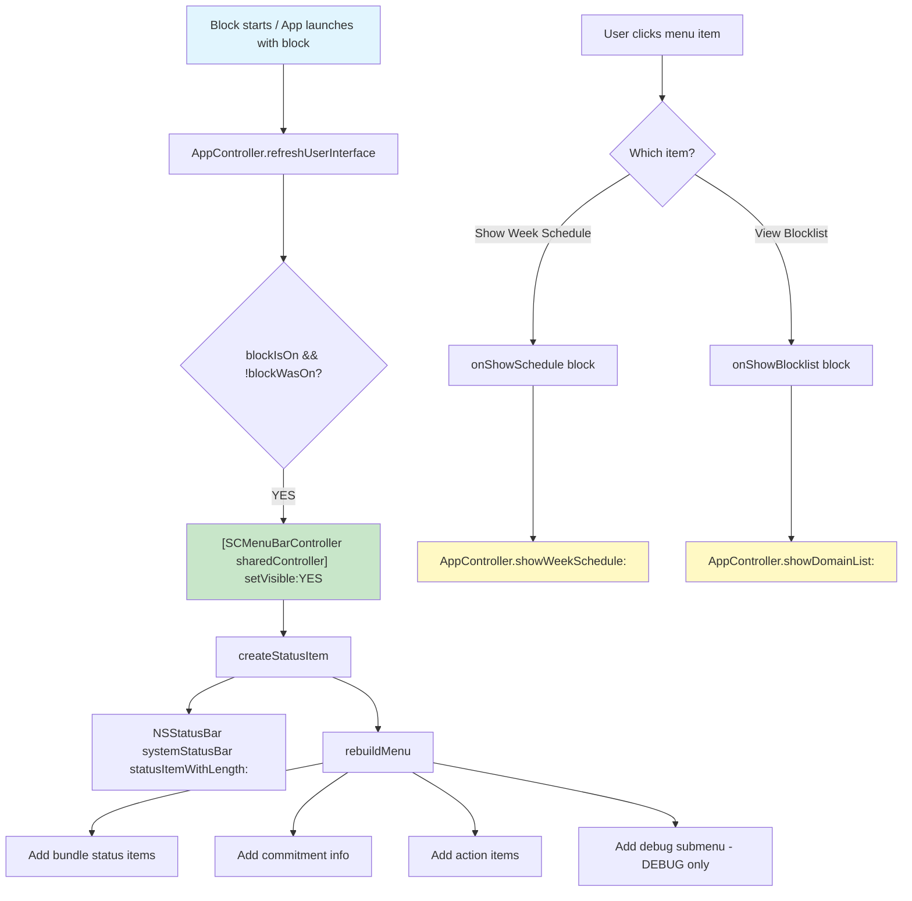

# Menu Bar

<!-- KEYWORDS: menu bar, status item, NSStatusItem, status menu, fence icon, LSUIElement, menu bar UI, picket fence, status bar -->

**Also known as:** Status Item, Menu Bar UI, Status Menu

---

## Brief Definition

The macOS menu bar status item that serves as the primary UI when the app is running, showing bundle status and providing quick actions.

---

## Detailed Definition

The Menu Bar is an `NSStatusItem`-based interface that appears in the macOS menu bar (top-right area). Since the app runs as `LSUIElement=YES` (no dock icon), the menu bar is the **primary way users interact with SelfControl** when a block is active.

**Visual appearance:**
- **Icon:** Picket fence template image (adapts to light/dark mode)
- **Click:** Opens dropdown menu with status and actions

**Menu structure (when committed):**
```
┌─────────────────────────────────────┐
│ ● noise allowed till 8:16pm        │  ← Status pill (green)
│ ● bundle2 blocked till Sun 11:59pm │  ← Status pill (red)
├─────────────────────────────────────┤
│ Committed until Sunday             │  ← Info (disabled)
├─────────────────────────────────────┤
│ Show Week Schedule                 │  ← Action
│ View Blocklist (4 sites, 2 apps)   │  ← Action with count
├─────────────────────────────────────┤
│ Debug Options                      │  ← DEBUG builds only
└─────────────────────────────────────┘
```

**Menu structure (when NOT committed):**
```
┌─────────────────────────────────────┐
│ No active commitment               │  ← Info (disabled)
├─────────────────────────────────────┤
│ Show Week Schedule                 │  ← Action
│ View Blocklist (4 sites, 2 apps)   │  ← Action with count
├─────────────────────────────────────┤
│ Debug Options                      │  ← DEBUG builds only
└─────────────────────────────────────┘
```

**Note:** Status pills are only shown when committed (same as week schedule status bar).

---

## Context/Trigger

- **Created:** When block starts running (`refreshUserInterface` in AppController)
- **Visibility:** Controlled via `[[SCMenuBarController sharedController] setVisible:YES/NO]`
- **Updates:** Immediately on `SCScheduleManagerDidChangeNotification` + every 60 seconds via timer
- **Primary UI:** When committed, this is the only visible UI (no windows open)

---

## Menu Items

| Item | Type | Action |
|------|------|--------|
| Bundle status pills | Info (disabled) | Shows "● name status till time" with colored text (only when committed) |
| Commitment info | Info (disabled) | Shows "Committed until [day]" or "No active commitment" |
| Show Week Schedule | Action | Opens `SCWeekScheduleWindowController` |
| View Blocklist (X sites, Y apps) | Action | Opens `DomainListWindowController` |
| Debug Options | Submenu (DEBUG only) | "Disable All Blocking", "Reset Emergency Credits" |

---

## Code Locations

| File | Purpose |
|------|---------|
| `SCMenuBarController.h` | Interface, action block properties |
| `SCMenuBarController.m` | Implementation, menu building, status image |
| `AppController.m:198` | Creates and shows menu bar when block starts |
| `AppController.m:200-207` | Sets action block handlers |
| `MenuBarFence.png` | Icon image (18x18 @1x) |
| `MenuBarFence@2x.png` | Icon image (36x36 @2x) |
| `Info.plist` | `LSUIElement=YES` makes app menu-bar-only |

---

## Call Stack



---

## Status Pill Display Logic

| Condition | Color | Format |
|-----------|-------|--------|
| Bundle is allowed | Green | `● name allowed till h:mma` |
| Bundle is blocked | Red | `● name blocked till h:mma` |
| State changes later day | - | `till EEE h:mma` (includes day) |

---

## Related Terms

- [Status Pill](status-pill.md) - The colored status display format (also used in week schedule window)
- [Committed State](committed-state.md) - Menu bar is primary UI when committed
- [Bundle](bundle.md) - Each bundle gets a status line in the menu
- [Emergency Unlock](emergency-unlock.md) - Debug menu can reset credits

---

## Anti-definitions (What this is NOT)

- **NOT** the same as Status Pill - Status pills are a visual format used in multiple places; menu bar is a specific UI component
- **NOT** visible when no block is running - Only appears when `blockIsOn`
- **NOT** the main app menu bar - This is a status item (right side), not the app's File/Edit/etc menu (which is hidden due to `LSUIElement`)

---

## Configuration

| Setting | Location | Value |
|---------|----------|-------|
| `LSUIElement` | Info.plist | `YES` - App has no dock icon, menu bar only |
| Icon | MenuBarFence.png | Template image (black silhouette) |
| Update interval | SCMenuBarController.m | 60 seconds |

---

## Example

```objc
// Show menu bar when block starts
[[SCMenuBarController sharedController] setVisible:YES];

// Set up action handlers
[SCMenuBarController sharedController].onShowSchedule = ^{
    [self showWeekSchedule:self];
};
[SCMenuBarController sharedController].onShowBlocklist = ^{
    [self showDomainList:self];
};
```
