# Pre-Authorized Schedule

<!-- KEYWORDS: pre-authorized, preauthorized, registered, daemon, password-free, schedule-id, launchd -->

**Also known as:** Registered Schedule, Daemon-Authorized Schedule

---

## Brief Definition

A segment registered with the daemon at commit time, allowing execution without password prompts at runtime.

---

## Detailed Definition

Pre-Authorized Schedules solve the UX problem of requiring password prompts every time a scheduled block starts. At commit time (when user enters password once), each [Segment](segment.md) is registered with the daemon:

1. **Merged blocklist** stored in root-owned settings (`/usr/local/etc/`)
2. **Segment ID (UUID)** used as reference
3. **launchd job** triggers CLI with `--schedule-id UUID` (not `--blocklist`)
4. **At runtime**: Daemon looks up pre-registered schedule, no auth needed

This is the same data as a Segment, but the term emphasizes it's been **authorized for future execution**.

---

## Context/Trigger

- Created during `commitScheduleForWeekOffset:`
- For each Segment, `registerScheduleWithID:blocklist:...` called
- Daemon stores in root-only plist file
- launchd job references by `--schedule-id`

---

## Code Locations

| File | Purpose |
|------|---------|
| `Block Management/SCScheduleLaunchdBridge.m` | `installJobForSegmentWithBundles:segmentID:...` |
| `Common/SCXPCClient.m` | `registerScheduleWithID:blocklist:...` |
| `Daemon/SCDaemonBlockMethods.m` | Stores schedule in root settings |
| `Daemon/SCDaemonBlockMethods.m` | `startScheduledBlockWithID:endDate:reply:` |

---

## Storage

```
/usr/local/etc/.{hash}.plist  (root-owned)

ApprovedSchedules: {
    "{segment-UUID}": {
        "blocklist": [...],
        "isAllowlist": false,
        "blockSettings": {...},
        "controllingUID": 501,
        "registeredAt": <date>
    }
}
```

---

## Call Stack

```mermaid
graph TD
    subgraph "At Commit Time (Password Required)"
        A[Segment created] --> B[registerScheduleWithID:blocklist:...]
        B --> C[XPC call to daemon]
        C --> D[Daemon stores in ApprovedSchedules]
        D --> E[Create launchd job with --schedule-id]
    end

    subgraph "At Scheduled Time (NO Password)"
        F[launchd triggers at start time] --> G[selfcontrol-cli start --schedule-id UUID]
        G --> H[CLI calls startScheduledBlockWithID:endDate:]
        H --> I[Daemon looks up UUID in ApprovedSchedules]
        I --> J[Block starts - no auth prompt]
    end

    style A fill:#e1f5fe
    style J fill:#c8e6c9
```



---

## Related Terms

- [Segment](segment.md) - Pre-Authorized Schedule IS a registered segment
- [Committed State](committed-state.md) - Pre-authorization happens at commit
- [Merged Blocklist](merged-blocklist.md) - Stored with the pre-authorized schedule

---

## Anti-definitions (What this is NOT)

- **NOT** a different data structure than Segment - same data, different lifecycle stage
- **NOT** stored in user preferences - stored in root-owned daemon settings
- **NOT** triggered by password at runtime - that's the whole point

---

## Lifecycle

```
Segment (computed)
    ↓ registerScheduleWithID:
Pre-Authorized Schedule (stored in daemon)
    ↓ launchd triggers at startDate
Active Block (blocking in effect)
    ↓ endDate reached
Expired (cleaned up)
```

---

## launchd Job Format

```xml
<plist>
    <dict>
        <key>Label</key>
        <string>org.eyebeam.selfcontrol.schedule.merged-{UUID}.monday.0900</string>
        <key>ProgramArguments</key>
        <array>
            <string>/path/to/selfcontrol-cli</string>
            <string>start</string>
            <string>--schedule-id={UUID}</string>
            <string>--enddate=2024-12-23T17:00:00Z</string>
        </array>
        <key>StartCalendarInterval</key>
        <dict>
            <key>Weekday</key><integer>1</integer>
            <key>Hour</key><integer>9</integer>
            <key>Minute</key><integer>0</integer>
        </dict>
    </dict>
</plist>
```
