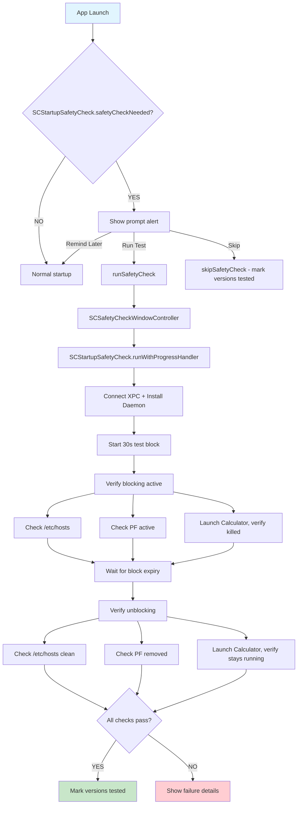

## Safety Test

<!-- KEYWORDS: safety, check, test, startup, verification, blocking, unblocking, version, debug, calculator, example.com -->

**Aliases:** Safety Check, Startup Safety Check

**Brief Definition:**
An automated test that verifies blocking and unblocking work correctly after a macOS or app version change. Runs in both DEBUG and Release builds.

**Detailed Definition:**
The Safety Test is an automated verification routine that runs when either macOS or SelfControl's version changes. It executes a 30-second test block targeting `example.com` (website) and Calculator (app), then verifies:
1. **Blocking phase:** hosts file, packet filter, and app termination all work
2. **Unblocking phase:** hosts file cleaned, PF rules removed, app can launch and stay running

This ensures the blocking mechanisms are working before the user relies on them for productivity.

**Context/Trigger:**
- Automatically prompts on app launch if `SCVersionTracker.anyVersionChanged` returns YES (all builds)
- User can manually trigger via Debug menu: "Run Safety Check..." (DEBUG builds only)
- User can skip (marks versions as tested) or defer (prompts again next launch)

**Test Targets:**
- Website: `example.com`
- App: `com.apple.calculator` (Calculator)

**Duration:** 30 seconds

**Checks Performed:**

| Phase | Check | Method |
|-------|-------|--------|
| Blocking | Hosts file contains `example.com` | Read `/etc/hosts` |
| Blocking | Packet filter rules active | `PacketFilter.blockFoundInPF` |
| Blocking | Calculator killed within 3s | Launch + poll `isCalculatorRunning` |
| Unblocking | Hosts file cleaned | Read `/etc/hosts` |
| Unblocking | PF rules removed | `PacketFilter.blockFoundInPF` |
| Unblocking | Calculator stays running 3s | Launch + poll `isCalculatorRunning` |

**Code Locations:**
- `Common/SCStartupSafetyCheck.h` - Orchestrator interface
- `Common/SCStartupSafetyCheck.m` - Test logic implementation
- `SCSafetyCheckWindowController.h/m` - Progress UI window
- `AppController.m:showSafetyCheckPrompt` - Launch trigger
- `Common/Utility/SCVersionTracker.h/m` - Version change detection

**Call Stack:**



**Result Structure:**

```objc
@interface SCSafetyCheckResult : NSObject
@property (readonly) BOOL passed;
@property (readonly) BOOL hostsBlockWorked;
@property (readonly) BOOL pfBlockWorked;
@property (readonly) BOOL appBlockWorked;
@property (readonly) BOOL hostsUnblockWorked;
@property (readonly) BOOL pfUnblockWorked;
@property (readonly) BOOL appUnblockWorked;
@property (readonly) NSString* errorMessage;
@property (readonly) NSArray<NSString*>* issues;
@end
```

**Related Terms:** Entry, Bundle, Debug Mode

**Anti-definitions (What this is NOT):**
- ❌ NOT a user-facing block (uses internal XPC call, not commit flow)
- ❌ NOT testing schedule functionality (just raw blocking mechanisms)
- ❌ NOT run on every launch (only when version changes)

**Important Notes:**
- The test uses `SCVersionTracker` to detect macOS/app version changes
- On pass, versions are marked as tested to prevent re-prompting
- Skip also marks versions as tested (user trusts it works)
- "Remind Me Later" does nothing, prompts again next launch
