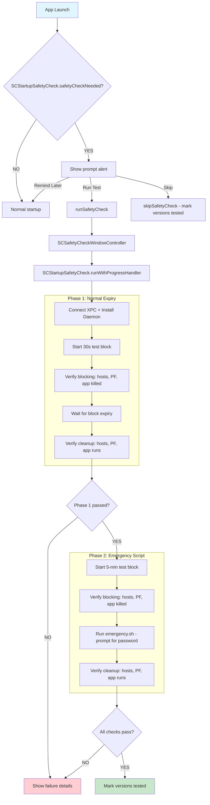

## Safety Test

<!-- KEYWORDS: safety, check, test, startup, verification, blocking, unblocking, version, debug, calculator, example.com -->

**Aliases:** Safety Check, Startup Safety Check

**Brief Definition:**
An automated test that verifies blocking and unblocking work correctly after a macOS or app version change. Runs in both DEBUG and Release builds.

**Detailed Definition:**
The Safety Test is an automated verification routine that runs when either macOS or Fence's version changes. It runs two phases targeting `example.com` (website) and Calculator (app):

**Phase 1 - Normal Expiry Test (30s):**
1. Start test block, verify blocking works (hosts, PF, app killed)
2. Wait for block to expire naturally
3. Verify cleanup worked (hosts clean, PF removed, app can run)

**Phase 2 - Emergency Script Test:**
1. Start new test block, verify blocking works (hosts, PF, app killed)
2. Run `emergency.sh` with admin privileges (prompts for password)
3. Verify emergency cleanup worked (hosts clean, PF removed, app can run)

This ensures both the normal daemon cleanup AND the emergency recovery script work correctly.

**Context/Trigger:**
- Automatically prompts on app launch if `SCVersionTracker.anyVersionChanged` returns YES (all builds)
- User can manually trigger via Debug menu: "Run Safety Check..." (DEBUG builds only)
- User can skip (marks versions as tested) or defer (prompts again next launch)

**Test Targets:**
- Website: `example.com`
- App: `com.apple.calculator` (Calculator)

**Duration:** ~45-60 seconds total (30s Phase 1 + Phase 2)

**Checks Performed:**

| Phase | Check | Method |
|-------|-------|--------|
| **Phase 1: Normal Expiry** | | |
| Blocking | Hosts file contains `example.com` | Read `/etc/hosts` |
| Blocking | Packet filter rules active | XPC `isPFBlockActive` |
| Blocking | Calculator killed within 3s | Launch + poll `isCalculatorRunning` |
| Unblocking | Hosts file cleaned | Read `/etc/hosts` |
| Unblocking | PF rules removed | XPC `isPFBlockActive` |
| Unblocking | Calculator stays running 3s | Launch + poll `isCalculatorRunning` |
| **Phase 2: Emergency Script** | | |
| Blocking | Hosts file contains `example.com` | Read `/etc/hosts` |
| Blocking | Packet filter rules active | XPC `isPFBlockActive` |
| Blocking | Calculator killed within 3s | Launch + poll `isCalculatorRunning` |
| emergency.sh | Run with admin privileges | AppleScript `do shell script ... with administrator privileges` |
| Cleanup | Hosts file cleaned | Read `/etc/hosts` |
| Cleanup | PF rules removed | XPC `isPFBlockActive` |
| Cleanup | Calculator stays running 3s | Launch + poll `isCalculatorRunning` |

**Code Locations:**
- `Common/SCStartupSafetyCheck.h` - Orchestrator interface
- `Common/SCStartupSafetyCheck.m` - Test logic implementation
- `SCSafetyCheckWindowController.h/m` - Progress UI window
- `AppController.m:showSafetyCheckPrompt` - Launch trigger
- `Common/Utility/SCVersionTracker.h/m` - Version change detection
- `emergency.sh` - Emergency cleanup script (bundled in app, tested in Phase 2)

**Call Stack:**



**Result Structure:**

```objc
@interface SCSafetyCheckResult : NSObject
@property (readonly) BOOL passed;
// Phase 1 results
@property (readonly) BOOL hostsBlockWorked;
@property (readonly) BOOL pfBlockWorked;
@property (readonly) BOOL appBlockWorked;
@property (readonly) BOOL hostsUnblockWorked;
@property (readonly) BOOL pfUnblockWorked;
@property (readonly) BOOL appUnblockWorked;
// Phase 2 result (tests all: hosts, PF, app blocking/unblocking via emergency.sh)
@property (readonly) BOOL emergencyScriptWorked;
@property (readonly) NSString* errorMessage;
@property (readonly) NSArray<NSString*>* issues;
@end
```

**Related Terms:** Entry, Bundle, Debug Mode

**Anti-definitions (What this is NOT):**
- ❌ NOT a user-facing block (uses internal XPC call, not commit flow)
- ❌ NOT testing schedule functionality (just raw blocking mechanisms)
- ❌ NOT run on every launch (only when version changes)

**Important Notes:**
- The test uses `SCVersionTracker` to detect macOS/app version changes
- On pass, versions are marked as tested to prevent re-prompting
- Skip also marks versions as tested (user trusts it works)
- "Remind Me Later" does nothing, prompts again next launch
