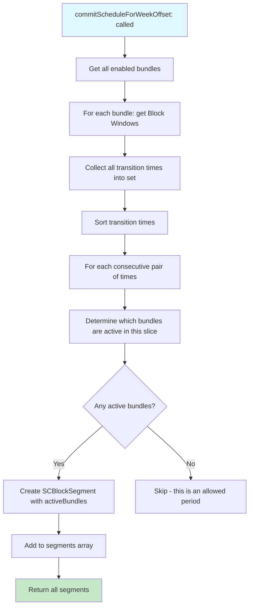

# Segment

<!-- KEYWORDS: segment, segmentation, transition, time slice, active bundles, SCBlockSegment, merge -->

**Also known as:** Block Segment, Time Segment, Transition Segment

---

## Brief Definition

A time slice with a consistent set of active bundles - the result of segmentation across all bundle schedules.

---

## Detailed Definition

Segmentation is the process of taking Block Windows from ALL bundles and finding transition points where the set of active bundles changes. Each Segment represents a period where the same bundles are blocking.

**Example:**
```
Bundle A: Block 9:00-12:00, 14:00-17:00
Bundle B: Block 10:00-15:00

Segments:
  9:00-10:00  → [A]           (only A blocking)
  10:00-12:00 → [A, B]        (both blocking)
  12:00-14:00 → [B]           (only B blocking)
  14:00-15:00 → [A, B]        (both blocking)
  15:00-17:00 → [A]           (only A blocking)
```

Each Segment gets its own [Merged Blocklist](merged-blocklist.md) and becomes a [Pre-Authorized Schedule](pre-authorized-schedule.md).

---

## Context/Trigger

- Computed at commit time by `calculateBlockSegmentsForBundles:weekOffset:bridge:`
- Input: Block Windows from all enabled bundles
- Output: Array of `SCBlockSegment` objects

---

## Code Locations

| File | Purpose |
|------|---------|
| `Block Management/SCScheduleManager.m` | `SCBlockSegment` class (internal) |
| `Block Management/SCScheduleManager.m` | `calculateBlockSegmentsForBundles:weekOffset:bridge:` |

---

## Data Model

```objc
@interface SCBlockSegment : NSObject
@property (nonatomic, strong) NSDate *startDate;
@property (nonatomic, strong) NSDate *endDate;
@property (nonatomic, assign) SCDayOfWeek day;
@property (nonatomic, assign) NSInteger startMinutes;
@property (nonatomic, strong) NSMutableArray<SCBlockBundle *> *activeBundles;
@property (nonatomic, strong) NSString *segmentID;  // UUID
@end
```

---

## Call Stack



---

## Related Terms

- [Block Window](block-window.md) - Input to segmentation
- [Merged Blocklist](merged-blocklist.md) - Created for each segment
- [Pre-Authorized Schedule](pre-authorized-schedule.md) - Segment after daemon registration
- [Committed State](committed-state.md) - Segmentation happens at commit

---

## Anti-definitions (What this is NOT)

- **NOT** a single bundle's schedule - spans ALL bundles
- **NOT** user-defined - computed from all Block Windows
- **NOT** the same as Block Window - Block Windows are per-bundle, Segments span bundles

---

## Algorithm

```
function calculateSegments(allBundles):
    // Step 1: Collect all block windows from all bundles
    allWindows = []
    for bundle in allBundles:
        for window in bundle.blockWindows:
            allWindows.append({bundle, window})

    // Step 2: Collect all unique transition times
    transitionTimes = Set()
    for entry in allWindows:
        transitionTimes.add(entry.window.startDate)
        transitionTimes.add(entry.window.endDate)

    sortedTimes = sort(transitionTimes)

    // Step 3: For each time slice, determine active bundles
    segments = []
    for i in range(len(sortedTimes) - 1):
        sliceStart = sortedTimes[i]
        sliceEnd = sortedTimes[i + 1]

        activeBundles = []
        for entry in allWindows:
            if entry.window.contains(sliceStart, sliceEnd):
                activeBundles.append(entry.bundle)

        if activeBundles is not empty:
            segments.append(Segment(sliceStart, sliceEnd, activeBundles))

    return segments
```

---

## Visual Example

```
Timeline:  9:00   10:00   12:00   14:00   15:00   17:00
           ├──────┼───────┼───────┼───────┼───────┤

Bundle A:  ████████████████       █████████████████
           (blocking)             (blocking)

Bundle B:         ██████████████████████████
                  (blocking)

Segments:  ├─S1──┼──S2───┼──S3───┼──S4───┼──S5───┤
           [A]   [A,B]   [B]     [A,B]   [A]
```
