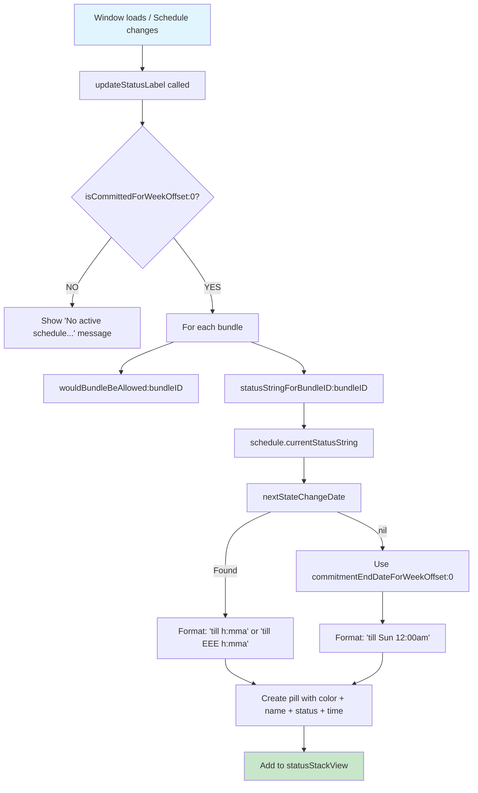

# Status Pill

<!-- KEYWORDS: status, pill, badge, indicator, blocked, allowed, till, statusStackView, updateStatusLabel -->

**Also known as:** Status Badge, Block Indicator, Bundle Status

---

## Brief Definition

A colored pill-shaped UI element showing a bundle's current blocking state and when it changes.

---

## Detailed Definition

Status Pills are horizontal colored badges displayed at the top of the main schedule window. Each pill shows:
- **Color dot** - The bundle's identifying color
- **Bundle name** - e.g., "noise"
- **Status word** - "blocked" or "allowed"
- **Time reference** - When the status changes (e.g., "till 5:00pm")

**Visual format:** `● noise blocked till 5:00pm`

Pills only appear when a schedule is [committed](committed-state.md). When not committed, the status area shows: "No active schedule - do you have the courage to commit?"

---

## Context/Trigger

- Displayed when `isCommittedForWeekOffset:0` returns YES
- Updated via `SCScheduleManagerDidChangeNotification`
- Refreshed on window load, schedule changes, and week navigation

---

## Status Format Logic

| Scenario | Format | Example |
|----------|--------|---------|
| State change TODAY | `status till h:mma` | `blocked till 5:00pm` |
| State change LATER DAY | `status till EEE h:mma` | `blocked till Mon 5:00pm` |
| No allowed windows (blocked all week) | `status till EEE h:mma` | `blocked till Sun 12:00am` |
| Currently allowed | `allowed till h:mma` | `allowed till 8:16pm` |

---

## Code Locations

| File | Purpose |
|------|---------|
| `SCWeekScheduleWindowController.m` | `updateStatusLabel` - creates and styles pills |
| `SCWeekScheduleWindowController.m` | `statusStackView` - container for pills |
| `Block Management/SCScheduleManager.m` | `statusStringForBundleID:` - generates "till X" text |
| `Block Management/SCWeeklySchedule.m` | `currentStatusString` - calculates next state change |
| `Block Management/SCWeeklySchedule.m` | `nextStateChangeDate` - finds when state changes |

---

## Call Stack



---

## Visual Styling

| State | Background | Border | Text Color |
|-------|------------|--------|------------|
| Allowed | Green @ 25% alpha | Green @ 50% alpha | System Green |
| Blocked | Red @ 25% alpha | Red @ 50% alpha | System Red |

**Container:** Semi-transparent frosted glass effect, 50px height, 8px corner radius

---

## Related Terms

- [Committed State](committed-state.md) - Pills only show when committed
- [Allowed Window](allowed-window.md) - Determines "till" time for state changes
- [Bundle](bundle.md) - Each bundle gets its own pill

---

## Anti-definitions (What this is NOT)

- **NOT** the menu bar status - this is in the main window
- **NOT** segment-based - shows per-bundle state from user's allowed windows
- **NOT** visible when uncommitted - requires active commitment

---

## Example

```
Committed schedule, Sunday 3pm:
┌──────────────────────────────────────────────────────────────┐
│ ● noise allowed till 8:16pm │ ● bundle2 blocked till Sun 12:00am │
└──────────────────────────────────────────────────────────────┘

"noise" has allowed window 6pm-10pm today, currently in it
"bundle2" has no allowed windows this week
```
