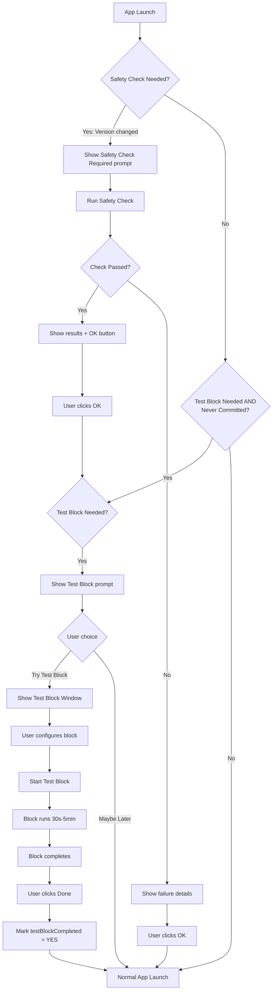

# Onboarding Flow

## Overview

New users go through a safety check and test block flow to verify blocking works on their system before committing to a schedule.

## Flow Diagram

## State Variables

| Key | Type | Purpose |
|-----|------|---------|
| `SCSafetyCheck_LastTestedAppVersion` | String | Last app version that passed safety check |
| `SCSafetyCheck_LastTestedOSVersion` | String | Last macOS version that passed safety check |
| `SCTestBlock_Completed` | Bool | User has completed a test block |
| `SCHasEverCommitted` | Bool | User has ever committed to a schedule |

## Skip Conditions

The test block prompt is **skipped** if ANY of these are true:
- User has completed a test block (`SCTestBlock_Completed = YES`)
- User has ever committed to a schedule (`SCHasEverCommitted = YES`)

## Trigger Conditions

### Safety Check Triggers
- App version changed since last safety check
- macOS version changed since last safety check

### Test Block Prompt Triggers
- Safety check just passed, OR
- Safety check not needed but test block never completed AND user never committed

## Key Files

| File | Purpose |
|------|---------|
| `Common/Utility/SCVersionTracker.h/m` | Tracks versions and completion states |
| `Common/SCStartupSafetyCheck.h/m` | Safety check logic |
| `SCSafetyCheckWindowController.h/m` | Safety check UI |
| `SCTestBlockWindowController.h/m` | Test block UI |
| `AppController.m` | Launch flow orchestration |
